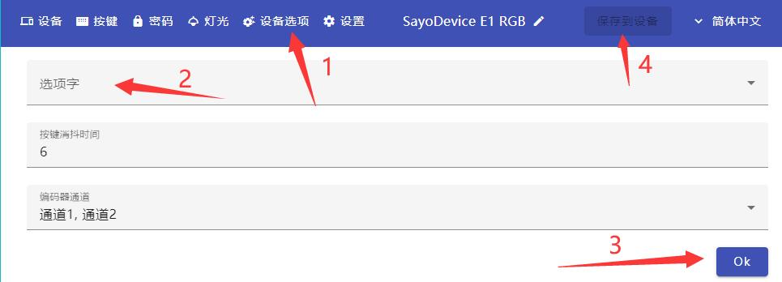

# 选项字节

> ### 设置流程

> ### 上电启动延时
开启此选项后，usb插入后延时0.5秒才会被识别。适用于一些速度较慢的电脑。
如果设备无法正常识别可以尝试开启

> ### 启用Joystick
开启此选项后，键盘可以被游戏识别为游戏控制器。
这个属于额外的加载项，仅适用于windows。mac系统 **千万不要** 开启。  
在选项字节里面开启 **joystick** 保存重插，  
按键模式改为 **游戏控制器**，  
然后选择按键编号。  
这个按键和游戏手柄的任何按键都没关系，需要游戏支持自定义按键才行。  

> ### KVM Compatibility mode
已废弃，无需理会

> ### 禁用灯光
顾名思义，打开这个功能后会屏蔽灯光。

> ### surface dial mode
单旋钮才有用的选项。
在windows里可以不同软件设置不同功能。
设置后需要保存并重新连接数据线

> ### AZERTY Keyboard
开启此模式后，一键密码适用于法语键盘。
其他键盘不要开启此功能。

> ### 按键消抖时间
后置消抖，默认值6，一般不建议修改。
如果按键发生双击，可以尝试加大这个数值到20以上

> ### 编码器通道
对于旋钮才有用的选项，不要修改。
