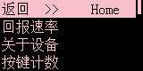
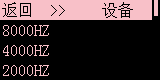
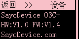
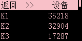
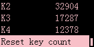
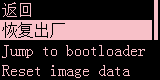

# 设备设置

> ## 回报速率
>
> 修改设备的回报率

---

> ## 关于设备
>
> 这儿没啥可操作的

- **HW**  
  硬件版本（可能不准确）
- **FW**  
  固件版本（大版本）

---

> ## 按键计数
>
> 显示从出厂或上一次重置按键计数到现在各个按键你按了多少次

  

- **Reset key count**  
  重置按键计数

---

> ## 恢复出厂
>
> 一些重置操作

- **恢复出厂**  
（**不会重置按键计数**）
- **jump to bootloader**  
  进入固件更新模式
- **Reset image data**  
  清空自定义图片
