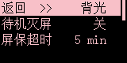
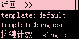

# 显示设置

> ## 背光

### 待机灭屏

如果你的电脑 **关机之后 USB 不断电** 的话，**打开** 这个选项就能让你的电脑关机之后 **小屏幕也关掉屏幕背光**

### 屏保超时

设置闲置多长时间显示休眠画面

---

> ## 主屏幕

!> **!!!警告：选择模板会覆盖你的自定义主界面设置!!!**

### 模板->默认

将主界面设置为由 SayoDevice 预置在你的键盘中的默认样式

### 模板->bongocat

将主界面设置为由 SayoDevice 预置在你的键盘中的 bongocat 样式

### 按键计数

选择主屏幕上按键计数器组件显示从什么时候到现在的按键敲击

- **全部**  
  从出厂或上一次 **重置按键计数器** 开始

- **本次使用**  
  从这次开机开始的计数
