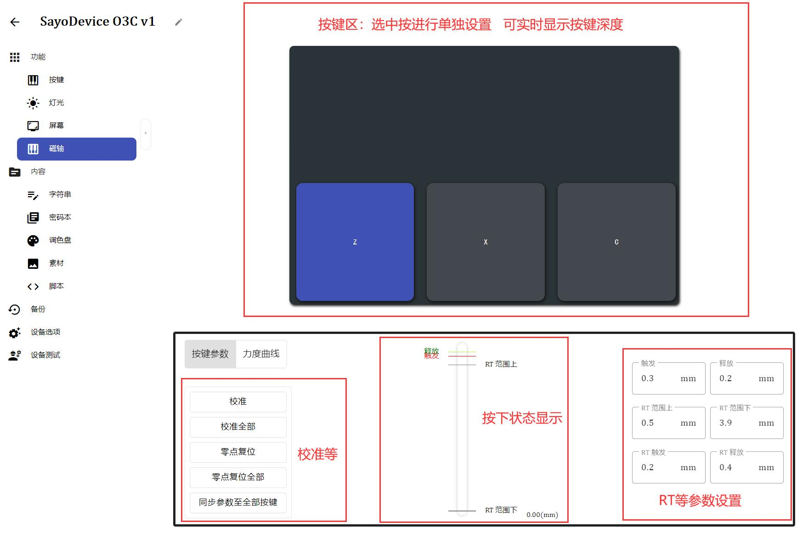

# 磁轴

!> 仅部分设备支持此功能

## 界面总览

> ## 校准

!> 如果按键释放不归零、更换轴体等情况，请校准一次按键。

---

> ## 参数设定（RT 等）
>
> RT 为 Rapid Trigger，又称快速触发  
> 通过检测按下或抬起特定距离来判断触发或释放按键  
> RT 功能推荐使用默认数值

- **触发**  
  当按下 **等于或大于** 设定的位置是触发按下操作 **默认值 0.3mm**  
  例外： 如果设置到 RT 范围内则不生效

  !>此参数是**绝对位置**  
  建议比**释放**参数至少大 0.1mm

- **释放**  
  当按键 **等于或小于** 设定的位置触发释放操作 **默认值 0.2mm**

  !>此参数是**绝对位置**，且优先级**最高**。
  建议大于 0.1mm，否则可能无法释放（因为轴体公差或晃动等）

- **RT 范围**  
  在这个范围内，RT 生效 **默认值 0.5mm ~ 3.8mm**

  !> **不建议**将 RT 范围下设置到超过 3.8mm 的位置  
  （因为轴体晃动可能无法按到底，可能会导致错误的释放）

- **RT 触发**  
  在 RT 范围内，且按键累计按下等于或大于设定的距离触发按下操作 **默认值 0.2mm**

  !>此参数是**相对长度**，相对于上次触发释放的位置  
  建议大于 0.1mm

- **RT 释放**  
  在 RT 范围内，且按键累计松开等于或大于设定的距离触发释放操作 **默认值 0.4mm**

  !>此参数是**相对长度**，相对于上次触发按下的位置  
  建议大于 0.2mm

> ## 禁用 RT
>
> 可以通过将 RT 触发 / RT 释放设置为比 RT 范围 更大的值来禁用 RT

> ## 特殊情况
>
> 待编辑
