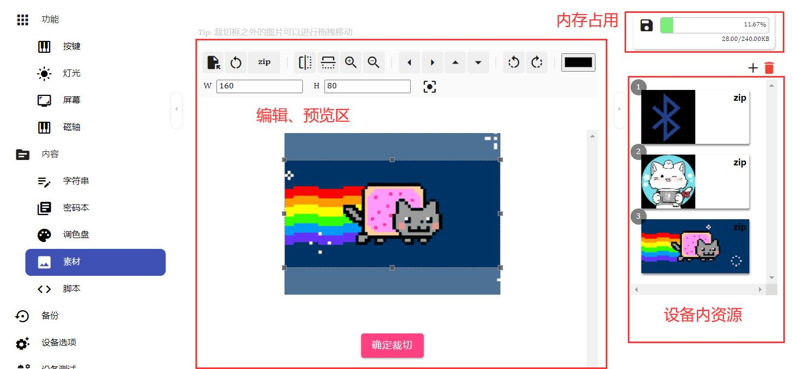
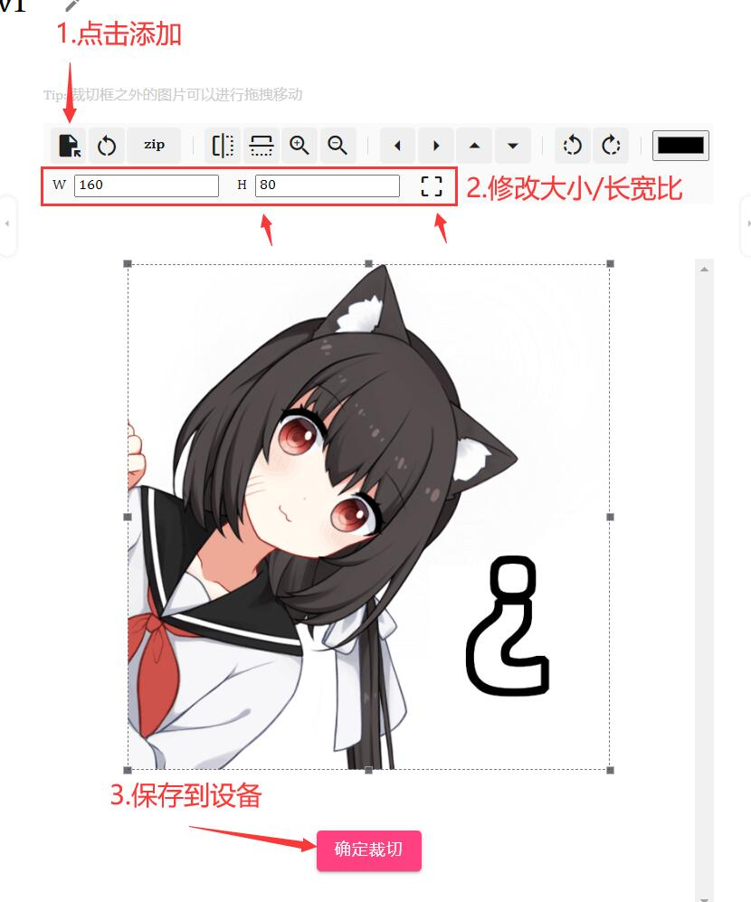
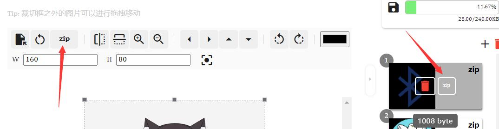

## 素材（图片等）

!> 仅部分带屏幕的设备  
此功能用来上传并管理图片等资源

## 界面总览

---

## 添加

1. 点击添加按钮，选择一张图片
2. 调整分辨率大小或比例选项
3. 确定裁剪，保存到设备

---

## 删除

在图片上点击删除按钮即可。  

---

## 压缩

因设备空间限制，压缩图片可以节省占用。  
在**编辑区**切换到**zip** 或者 **设备图片**上方点击**zip**按钮可以开关压缩

---

## 透明背景

目前不支持透明图片。  
但可以更改图片透明区域的背景颜色

---
