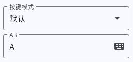
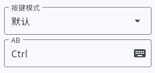
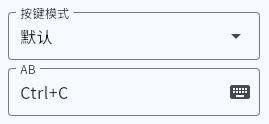
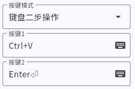
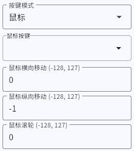
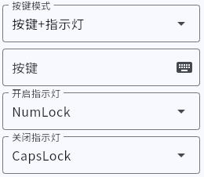
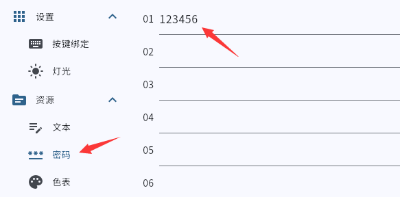
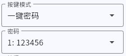
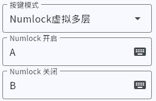

# 按键功能

> # 设置按键

1. 按键模式选择 **默认**，
2. 点击下面的框选择键盘按键

- **Ctrl Shift Alt Win** 可以 **不选、选择一个或多个**。
- **其他按键** 可以 **不选或选择一个**
- 再次点击按键可以取消选中

  <font size=5>举几个栗子</font>

- **设置字母 A**  
  

- **设置 Ctrl 键**  
  

---

> # 设置组合快捷键

- **设置 复制 快捷键 Ctrl+C**  
  

- **设置 截图 快捷键 Win+Shift+S**  
  

---

> # 设置两组连续的按键操作

!> 此模式按下后执行一组快捷键，松开按键后执行另一组快捷键

1. 按键模式选择 **二步操作**，
2. 设置两组按键即可，方法同上

- **设置一键粘贴+回车**  
  

---

> # 短按长按 2 功能

!> 此模式不适合旋钮

1. 按键模式选择 **短按长按 2 功能**，
2. 然后设置两组按键即可，方法同上

- **设置短按 A 长按 B**  
  

- **设置短按暂停长按下一曲**  
  

---

> # 鼠标模式
>
> 此模式可以设置一个按键为**鼠标左键 鼠标右键 滚轮按下** 或 **光标上下左右移动 滚轮上下滚动**

- **设置鼠标左键**  
  在 **鼠标按键** 选项框中选择按键。下面三个数值设为 0  
  

- **设置光标下移**  
  在 **鼠标按键** 选项框中取消全部按键，然后把 **鼠标移动 Y** 输入框填 -1  
  

- **设置滚轮下滚**  
  在 **鼠标按键** 选项框中取消全部按键，然后把 **滚动** 输入框填 -1

```
X 正数右移，负数左移
Y 正数上移，负数下移
滚轮正数上滚动，负数下滚动
数值越大移动速度越快
```

---

> # 多媒体控制
>
> 控制系统音量、切换歌曲、屏幕亮度等  
> _屏幕亮度功能仅适合笔记本电脑或某些支持在系统内调整亮度的屏幕_  
> _步进 参数是多倍执行，设置为 1 执行一次，2 执行 2 次。0 也会执行一次_

- **设置静音切换**  
  

---

> # 键盘+LED 控制
>
> _快捷键可以不选，达到只切换灯光状态的效果_  
> _包括 Num lock、CapsLock、Scroll Lock_

!> _此模式在触发快捷键的前后，还会触发指示灯相关的按键来更新相应的状态_

- **打开 numlock 指示灯并关闭 CapsLock 指示灯**  
  

---

> # A+B+C+D
>
> _此模式可以依次按下选中的按键，然后松开_  
> _适用于需要严格控制按键顺序的快捷键，或者较短的按键集。_  
> _最多选择 4 个按键_

---

> # 一键密码
>
> _此模式可以依次输入预设好的 ASCII 字符串_  
> _字符串后可以选择附加一个任意键，比如回车_  
> _可自定义输入间隔（毫秒）和锁定大小写选项_  
> _如果输入内容和设置的不一样，可以尝试开启锁定大小写功能。开启后，输入内容不会被输入法影响。_  
> _法语键盘请在 设置 里面更改按键布局_

- **设置 一键输入 ABCdef123 后回车**

1. 在**密码本**里面输入内容  
   
2. 在**按键**里面，把按键模式改成**一键密码**，选择保存的密码编号  
   

- 附加按键  
  在密码后面可以插入一个任意键，比如回车。

- 输入间隔  
  密码输入速度，单位毫秒，默认值 2.  
  一般不需要修改。如果发现输入会漏键需要加大这个数值

- 锁定大小写  
  输入密码的时候自动锁定键盘大写，开启此功能后密码输入才不会被输入法影响。

- 其他键盘布局  
  默认键盘布局是 ANSI，如果需要改为 AZERTY 布局，请点击“设备选项”开启

---

> # 一键网页
>
> 一键打开设置好的网址

!> 部分设备不支持此功能

适用于 windows 系统  
设置方法同一键密码

---

> # 一键写诗
>
> 一键输出一串文字

!> 部分设备不支持此功能

!> **可能存在快捷键冲突。**  
功能原理：
按住 Alt+小数字键盘的数字键直接输入字符编码。  
适用于 windows 系统

设置方法类似一键密码 但是在**字符串**选项卡里面输入内容  
支持两种编码方式（GBK\Unicode）  
不同软件需要的编码可能**不一样**，如果输入乱码可以**切换另一种编码**

---

> # shortcut \*3

!> 部分设备不支持此功能

此模式可以连续键入三个快捷键，如**全选+复制+切换标签卡（Ctrl+A Ctrl+C Ctrl+TAB）**

---

> # 循环输入
>
> 可以选择 1~3 个按键，当按住按键的时候依次循环按下，松开按键停止  
> 循环间隔时间 n\*6 ms

- **循环按方向下+空格**  
  

---

> # joystick 按键

!> 这个属于额外的加载项，仅适用于 windows。mac 系统 **不要** 开启。  
如果误开启，使用 windows 系统关闭。

在设备选项里的 HID 功能开启 **joystick** 保存重插，  
按键模式改为 **游戏控制器**，  
然后选择按键编号。  
这个按键和游戏手柄的任何按键都没关系，需要游戏支持自定义按键才行。

---

> # key to axis
>
> 此模式可以把一个线性按键映射成手柄摇杆信号（需要开启 设备功能：controller）  
> 或着鼠标光标移动（需要开启 设备功能：相对鼠标）

!> 部分设备不支持此功能

- 轴  
  可选 X Y Z rX rY rZ
- mouse X Y  
  鼠标的两个方向轴

- 对齐方式  
  可选左对齐、右对齐、中心左对齐、中心右对齐

---

> # Numlock 虚拟多层

!> _此模式仅适用于硬件不支持 FN 层的设备_  
_支持 FN 层的设备请使用 FN 功能_

- **数字锁开启时按键是 A，关闭时按键是 B**  
  

---

> # 按键分层（FN）

!> 部分设备不支持此功能

1. 将一个按键模式改成**FN**并选择需要切换的目标层级
2. 按下这个按键，键盘会切换到另一个层的功能
3. 松开这个按键，回到原来的层


---

> # 按键分层（SW）

!> 部分设备不支持此功能

与 FN 功能相似，但是松开按键的时候不会回到原来的层

> # 蓝牙多机切换（BLE_SW）

!> 部分设备不支持此功能  
仅蓝牙模式有效

- 设置一个键用来快速切换设备
- 如果设备不在线，将自动进入配对模式（白色 LED 闪烁）

---
