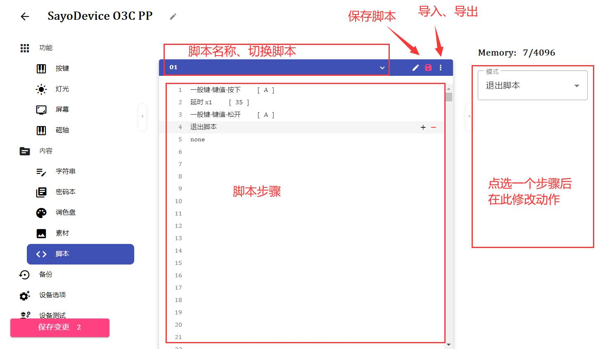
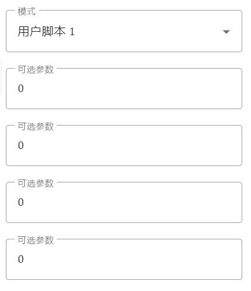

# 设备脚本

!> 仅部分设备支持此功能

## 前言

**概述**

可以用脚本实现一些复杂操作，包括但不限于

- 包括键盘、鼠标在内的一系列的操作组合
- 循环，整体循环局部循环
- 控制 LED 灯光效果
- 更复杂的操作（丰富的指令和接口）

**导读**

- 如果你没有编程基础，或不想深入研究，仅看前 3 章即可
- 一般情况，直接看指令表会更快找到答案
- 如果你看不懂，请不要停下。把文档完整读一遍后再看就明白了
- 。。。

## **0.入门**

**脚本是什么？**

- 脚本就是脚本，又称作宏。
- 脚本导演了一个序列事件的发生

**脚本能做什么？**

这取决于你自己

- 你可以使用脚本操作键盘输出按键、操作鼠标进行移动/点击等
- 也可以使用脚本来控制 RGB 灯光效果
- 甚至可以编写一个硬件计算器

**脚本是怎么运行的？**

- 一般情况下，按键作为键盘的开关，按下按键即可执行对应的脚本
- 执行脚本的同时，按键设置的 4 个参数将被传入脚本的寄存器
- 脚本的执行顺序是从上至下，顺序执行，并进行对应指令的操作
- 脚本会一直不停执行直到**延时**、**阻塞**或**退出**指令

## **1.最简单的操作脚本**

**脚本编辑界面**  


**一个按键操作（上图）**

- 最基本的 4 个步骤： 按下、延时、松开、延时（如脚本结束了可以不写延时）
- 延时单位是毫秒，1 秒=1000 毫秒。
- 延时至少 1 毫秒，建议至少 5 毫秒。太快电脑会反应不过来
- 一般人按键在 30 毫秒以上。

**将脚本绑定到按键**

1. 按键模式改成用户脚本+脚本编号 （No.xxx）
2. 填入参数（**不懂就不用管**）



**更多键盘按键**

- 重复 按下、延时、松开、延时 四个步骤即可
- 建议直接录制

## **2.基本指令**

### 延时

- 让脚本暂停一段时间
- 延时的单位是毫秒
- 延时数值范围 0\~255（使用变量除外）  
  **延时倍率**
  - X1：1=1ms 填多少数字就是多少毫秒
  - X256：1=256ms 填 1 就是 256 毫秒，2 就是 512 毫秒  
    **随机延时**
  - 随机范围 0~ 倍率 x 填写的数值
  - 填入的数值**绝对**不能为 0
- 几个例子
  **延时 0.1 秒（100 毫秒）**

```
-延时 x1 100
```

**延时 0.3 秒（300 毫秒）**

```
-延时 x1 200
-延时 x1 100
或
-延时 x256 1
-延时 x1 44
```

**范围延时 0.2~0.3 秒**

```
一条固定延时紧跟一条随机延时即可
-延时 x1 200
-延时-随机-x1 100
```

---

### 按键操作

- 输出基本的按键操作到电脑
- 两次按键操作之间必须加延时
- 支持任意操作嵌套  
  **键值**
  - 直接选取按键操作
  - 操作内容固定  
    **传参（一般用户无需使用）**
  - 通过参数传递或变量复用代码或脚本
  - 操作内容灵活
- 几个例子
  **按下按键 A 按下时间 35 毫秒（短按）**

```
-一般键-键值-按下 A
-延时 x1 35
-一般键-键值-松开 A
-延时 x1 35
```

**按下按键 A 按下时间 2 秒（长按）**

```
-一般键-键值-按下 A
-延时 x256 7
-延时 x1 208
-一般键-键值-松开 A
-延时 x1 35
```

**组合键 Ctrl+C**

```
-组合键-键值-按下 Ctrl
-延时 x1 35
-一般键-键值-按下 C
-延时 x1 35
-一般键-键值-松开 C
-延时 x1 35
-组合键-键值-松开 Ctrl
-延时 x1 35
```

**按下按键 A 按下时间 35 毫秒（短按）并循环执行**

```
-一般键-键值-按下 A
-延时 x1 35
-一般键-键值-松开 A
-延时 x1 35
-地址跳转 0 0
```

---

### 光标操作

- 移动/定位鼠标光标
- 两次按键操作之间必须加延时，操作后要再来一步清零
  **轴**
  - X 屏幕横向坐标，右侧正
  - Y 屏幕纵向坐标，下侧正
  - Scroll 滚轮操作
- 几个例子  
  **光标右移一段距离**

```
-鼠标-光标移动-值 X轴 10
-延时 x1 35
-鼠标-光标移动-值 X轴 0
-延时 x1 35
```

**光标下移一段距离**

```
-鼠标-光标移动-值 Y轴 10
-延时 x1 35
-鼠标-光标移动-值 Y轴 0
-延时 x1 35
```

**光标定位到指定坐标（x,y）并左键单击**

```
-鼠标-光标定位 100,100
-延时 x1 35
-鼠标键-键值-按下 左键
-延时 x1 35
-鼠标键-键值-松开 左键
-延时 x1 35
```

## **3.特殊指令**

### 进入点动模式

- 脚本默认是开关模式，按一下开始，（如果还在运行）再按一下停止。
- 点动模式下，脚本只能通过指令退出
- 一般放在第一条指令

### 按键阻塞

- 当运行到该步骤时，按键处于指定状态则脚本暂停运行
- 条件不成立时恢复运行  
   **举个例子**  
  **按下是 A，松开是 B**

```
-一般键-键值-按下 A
-延时 x1 35
-一般键-键值-松开 A
-延时 x1 35
-按键按下时阻塞
-一般键-键值-按下 B
-延时 x1 35
-一般键-键值-松开 B
-延时 x1 35
```

**按一下是 A，再按一下是 B（需要点动模式）**

```
-进入点动模式
-一般键-键值-按下 A
-延时 x1 35
-一般键-键值-松开 A
-延时 x1 35
-按键按下时阻塞
-按键松开时阻塞
-一般键-键值-按下 B
-延时 x1 35
-一般键-键值-松开 B
-延时 x1 35
```

### 按键状态退出

- **当运行到该步骤时**，按键处于指定状态则退出，否则向下执行  
   **举个例子**  
  **按住循环输出按键，松开退出**

```
-一般键-键值-按下 A
-延时 x1 35
-一般键-键值-松开 A
-延时 x1 35
-如果按键松开退出
-地址跳转 0 0
```

## **4.保留**

## **5.指令架构**

!> 请保证设备固件版本已更新到最新  
旧版本可能缺少某些寄存器（读出为 0）  
旧版本可能不支持某些指令（脚本会中途异常退出）

### 整体架构

- 一般情况下，脚本运行在按键上。
- 每个按键可以看做一个单独的线程，多线程运行。
- 每个线程寄存器独立，但可通过指针访问共享内存区域。
- 每个线程有 4 个 8 位参数寄存器（参数通过按键传入，非只读，可以独立重载）、4 个 32 位专用寄存器（作为数据暂存或指针）、1 个 32 位 A 寄存器（用于累加、乘除）、1 个 32 位 B 寄存器（用作除法）。

### 跳转控制

- 为更简单的进行跳转而无需计算地址，引入了 FLAG。
- 可通过 SET_FLAG 指令将下一条指令的地址压入寄存器。
- 跳转时，如果寄存器为 0 则向下搜索。

### 寄存器

| 名称           | 取值范围     | 读写 | 用法                                                                       |
| -------------- | ------------ | ---- | -------------------------------------------------------------------------- |
| 参数 1~参数 4  | 0~255        | RW   | 按键传入/通用寄存器                                                        |
| R0~R3          | 0~4294967295 | RW   | 通用寄存器                                                                 |
| A              | 0~4294967295 | RW   | 累加器/通用寄存器                                                          |
| B              | 0~4294967295 | RW   | 除法寄存器/通用寄存器                                                      |
| DPTR           | 0~4294967295 | RW   | 通用寄存器                                                                 |
| P_R0~P_R3      | ?            | RW   | 共享 RAM 内存区域指针                                                      |
| P_DPTR         | ？           | RO   | 数据指针                                                                   |
| ZERO           | 0            | RO   | 怎么读都是 0 嘛                                                            |
| IO             | 0~255        | RO   | IO 状态，0=按下                                                            |
| SYS_TIME_MS    | 0~999        | RO   | 系统时间，毫秒                                                             |
| SYS_TIME       | 0~4294967295 | RO   | 系统时间，秒                                                               |
| SYS_KB_LED     | 0~255        | RW   | 键盘 LED 状态 R：读取当前状态。 W：修改状态需要操作 2 次，以保证按键释放。 |
| SYS_KEY_NUM    | 0~4294967295 | RO   | 按键计数                                                                   |
| SYS_KEY_LAY    | 0~255        | RW   | 键盘层级                                                                   |
| S_SCRIPT_ADDR  | 0~4294967295 | RO   | 当前脚本步骤地址                                                           |
| S_DATA_RANDOM  | 0~4294967295 | RW   | R:获取一个随机数 W:设置随机数种子                                          |
| SYS_BLE_NUM    | 0~7          | WO   | 蓝牙多机切换，写后立即重启切换                                             |
| S_SELECTED_LED | 0~x          | RW   | 选中操作的 LED 灯。默认选中执行按键本身的 LED                              |
| GL0~GL127      | 0~4294967295 | RW   | 全局 通用寄存器，默认值未知，用前清零                                      |

## **6.操作指令**

### 按键操作指令

- 支持多种操作，包括键盘、鼠标、多媒体等。
- 指令支持传值和传参
- 支持控制按下和松开，支持乱序/嵌套，按下操作后必须有松开步骤
- 每次操作后至少加 1 毫秒延时，等待主机接收到操作

```
- 组合键
- 一般键
- 鼠标键
- 多媒体
- Joystick按键
- 鼠标光标移动
- 鼠标光标定位
```

## **7.跳转指令**

脚本支持流程控制（跳转），可内部跳转或向后一个脚本跳转
目前支持以下跳转指令

```
JZ  			//jump if (REG == 0)  参数值为0跳转，否则向下执行
JNZ 			//jump if (REG != 0) 参数值不为0跳转，否则向下执行
JC  			//jump if (CY == 0) 参数CY值为0跳转，否则向下执行
JNC 			//jump (if CY != 0) 参数CY值不为0跳转，否则向下执行
CJNE			//CY = (REG1 < REG2);jump if (REG1 != REG2)  如果REG1小于REG2则置位CY否则清零，如果不相等则跳转，否则向下执行
DJNZ			//jump if (--REG != 0)  REG先减一，如果不为零跳转，否则向下执行
```

可以使用更易用的 SET_FLAG 将目标地址写入寄存器，然后使用 JUMP_TO_FLAG 直接跳转到寄存器存储的地址而不需要计算地址

- 几个例子：
  · 短按输出 A 长按输出 B  
    
  解析：当按下按键后脚本会启动，然后首先延时等待 200 毫秒再次检查按键按下状态（IO 是按键状态，按下为 0），如果仍然按下则识别为长按并跳转到（R0）保存的地址以输出 B。否则继续执行输出 A 并退出；  
  虽然此时（R0）并未赋值，但其默认值是 0，程序会自动向后搜索直到 SET_FLAG。

- 局部循环  
    
  次数的参数也可以通过按键传入

## **8.算数指令**

待编辑

## **9.参数限定**

- 可以使用脚本名称限定传参类型

| 符号      | 用途                     | 格式                             | 备注                                                                                       |
| --------- | ------------------------ | -------------------------------- | ------------------------------------------------------------------------------------------ |
| ~         | 参数结束                 | ~                                | 结束后面是脚本名称（模式名称）                                                             |
| \\        | 参数类型限定             | \\a\\b\\c\\d~                    | 只解析一个字母（如果脚本名称不是以"\\"、"{"或"\~"开头，即默认按照"\\u\\u\\u\\u~"解析参数） |
|           | 参数名                   | \\m 组合键\\g 一般键~            | 字母后的就是参数名                                                                         |
| -         | 自定义选项(单选)         | \\U 开关-0 开-1 关~              | -数值+选项名                                                                               |
| =         | 自定义选项(多选)         | \\U 鼠标键=1 左键=2 右键=4 中键~ |
| {}        | 集合                     | {\\m\\g}短按{\\m\\g}长按~        |
| --------- | ------                   | ----------                       | ---                                                                                        |
| \\u       | 无符号数 0~255           |
| \\s       | 有符号数-128-127         |
| \\\\u     | 无符号数 0~65535         |
| \\\\s     | 有符号数-32768~32767     |
| \\\\\\u   | 同上                     |
| \\\\\\s   | 同上                     |
| \\m       | 修饰键                   |
| \\g       | 一般键                   |
| \\M       | 鼠标键                   |
| \\c       | 多媒体按键               |
| \\j       | joystick 按键            |
| \\a       | joystick 轴              |
| \\P       | 密码                     |
| \\S       | 字符串                   |
| \\A       | 键盘指示灯（Numlock 等） |
| \\L       | 按键层                   |
| \\U       | 用户自定义选项           |

## **-1.指令表**

!> 默认是小端序，除非有特别标注

| code | 助记符            | 长度 | 格式                         | 方法                                                                                      |
| ---- | ----------------- | ---- | ---------------------------- | ----------------------------------------------------------------------------------------- |
| 0x00 |                   |      |                              |                                                                                           |
| 0x01 | NOP               | 1    | NOP                          | NOP                                                                                       |
| 0x02 | JMP               | 3    | JMP addr16(BIG EDIT)         | PC=addr                                                                                   |
| 0x03 | SJMP              | 2    | SJMP rel(-128~+127)          | PC=PC+2+rel                                                                               |
| 0x04 |                   |      |                              |                                                                                           |
| 0x05 | SLEEP_X256        | 2    | SLEEP_X256 data8             | sleep data\*256 ms                                                                        |
| 0x06 | SLEEP             | 2    | SLEEP data8                  | sleep data\*1 ms                                                                          |
| 0x07 | SLEEP_RAND_X256   | 2    | SLEEP_RAND_X256 data8        | sleep random() % (data\*256) ms                                                           |
| 0x08 | SLEEP_RAND        | 2    | SLEEP_RAND data8             | sleep random() % (data\*1) ms                                                             |
| 0x09 | SLEEP_X256_VAL    | 2    | SLEEP_X256_VAL REG           | sleep REG\*256 ms                                                                         |
| 0x0A | SLEEP_VAL         | 2    | SLEEP_VAL REG                | sleep REG\*1 ms                                                                           |
| 0x0B | SLEEP_RAND_X8_VAL | 2    | SLEEP_X8_VAL REG             | sleep random() % (REG\*8) ms                                                              |
| 0x0C | SLEEP_RAND_VAL    | 2    | SLEEP_VAL REG                | sleep random() % (REG\*1) ms                                                              |
| 0X0D | SLEEP_U16         | 2    | SLEEP_U16 data16             | sleep data\*1ms                                                                           |
| 0x0E | SLEEP_RAND_U16    | 2    | SLEEP_RAND_U16 data16        | sleep random() % (data\*1) ms                                                             |
| 0x0F |
| 0X10 | S_SK              | 2    | S_SK keyboard_modifier_keys  | send press key(s) [data value](https://manual.sayodevice.com/format/modifier_keys.json)   |
| 0X11 | S_GK              | 2    | S_GK keyboard_general_keys   | send press a key [data value](https://manual.sayodevice.com/format/general_keys.json)     |
| 0X12 | S_MK              | 2    | S_MK mouse_keys              | send press key(s) [data value](https://manual.sayodevice.com/format/mouse_keys.json)      |
| 0X13 | S_MU              | 2    | S_MU multimedia_keys         | send press key(s) [data value](https://manual.sayodevice.com/format/mu_keys.json)         |
| 0X14 | S_SK_VAL          | 2    | S_SK_VAL REG                 | send press key(s) [data value](https://manual.sayodevice.com/format/modifier_keys.json)   |
| 0X15 | S_GK_VAL          | 2    | S_GK_VAL REG                 | send press a key [data value](https://manual.sayodevice.com/format/general_keys.json)     |
| 0X16 | S_MK_VAL          | 2    | S_MK_VAL REG                 | send press key(s) [data value](https://manual.sayodevice.com/format/mouse_keys.json)      |
| 0X17 | S_MU_VAL          | 2    | S_MU_VAL REG                 | send press key(s) [data value](https://manual.sayodevice.com/format/mu_keys.json)         |
| 0X18 | S_USK             | 2    | S_USK keyboard_modifier_keys | send release key(s) [data value](https://manual.sayodevice.com/format/modifier_keys.json) |
| 0X19 | S_UGK             | 2    | S_UGK keyboard_general_keys  | send release a key [data value](https://manual.sayodevice.com/format/general_keys.json)   |
| 0X1A | S_UMK             | 2    | S_UMK mouse_keys             | send release key(s) [data value](https://manual.sayodevice.com/format/mouse_keys.json)    |
| 0X1B | S_UMU             | 2    | S_UMU multimedia_keys        | send release key(s) [data value](https://manual.sayodevice.com/format/mu_keys.json)       |
| 0X1C | S_USK_VAL         | 2    | S_USK_VAL REG                | send release key(s) [data value](https://manual.sayodevice.com/format/modifier_keys.json) |
| 0X1D | S_UGK_VAL         | 2    | S_UGK_VAL REG                | send release a key [data value](https://manual.sayodevice.com/format/general_keys.json)   |
| 0X1E | S_UMK_VAL         | 2    | S_UMK_VAL REG                | send release key(s) [data value](https://manual.sayodevice.com/format/mouse_keys.json)    |
| 0X1F | S_UMU_VAL         | 2    | S_UMU_VAL REG                | send release key(s) [data value](https://manual.sayodevice.com/format/mu_keys.json)       |
| 0x20 |
| 0x21 | S_MO_DATA         | 3    | S_MO_DATA index data8        | send mouse data <br> (index 0=X 1=Y 2=Scroll)                                             |
| 0x22 | S_MO_VAL          | 3    | S_MO_VAL index REG           | send mouse data <br> (index 0=X 1=Y 2=Scroll)                                             |
| 0x23 | S_JOY_AXIS        | 4    | S_JOY_AXIS index data16      | send controler data <br> (index 0=X 1=Y 2=rX 3=rY 4=Z 5=rZ)                               |
| 0x24 | S_JOY_AXIS_VAL    | 3    | S_JOY_AXIS_VAL index REG     | send controler data <br> (index 0=X 1=Y 2=rX 3=rY 4=Z 5=rZ)                               |
| 0X25 | S_CURSOR          | 5    | S_CURSOR data16 data16       | send move mouse cursor to X Y                                                             |
| 0X26 | S_CURSOR_VAL      | 5    | S_CURSOR_VAL REG REG         | send move mouse cursor to X Y                                                             |
| 0X27 | S_DIAL            | 2    | S_DIAL data8                 | send DIAL data <br>(0=release 1=press 2=clockwise rotation 3=Anticlockwise rotation)      |
| 0X28 | S_DIAL_VAL        | 2    | S_DIAL REG                   | send DIAL data <br>(0=release 1=press 2=clockwise rotation 3=Anticlockwise rotation)      |
| 0X29 |
| 0X2A |
| 0X2B |
| 0X2C | S_JK              | 2    | S_JK data8                   | key num(0~127)                                                                            |
| 0X2D | S_JK_VAL          | 2    | S_JK_VAL REG                 | key num(0~127)                                                                            |
| 0X2E | S_UJK             | 2    | S_UJK data8                  | key num(0~127)                                                                            |
| 0X2F | S_UJK_VAL         | 2    | S_UJK_VAL REG                | key num(0~127)                                                                            |

待编辑
