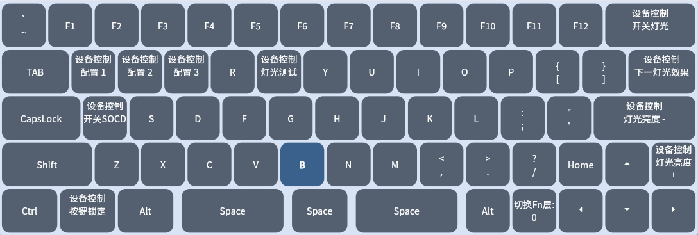
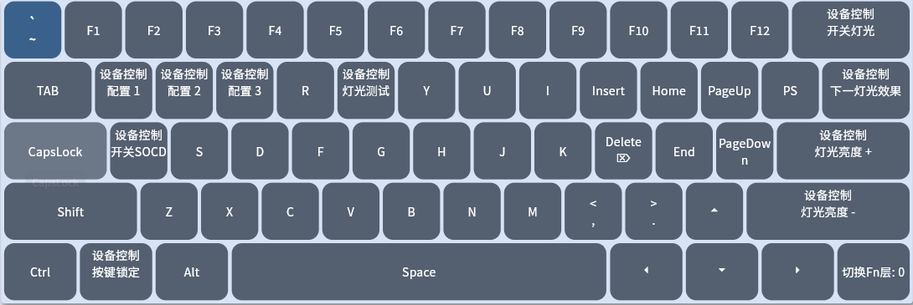

## Default Shortcuts  

### Default FN Layer Functions <!-- {docsify-ignore} -->  
Hold FN to activate shortcuts.  
> K64H3 K64H3MZ K66H3MZ  
  

> K61H3MZ  
  

## Other Shortcuts  
### Factory Reset:  
Hold for 3 seconds: ESC + Bottom-right key  
- ESC+Right Arrow (64/66-key)  
- ESC+FN (61-key)  

### Full Key Calibration:  
Hold for 3 seconds: ESC + R + Bottom-right key  
- ESC+R+Right Arrow (64/66-key)  
- ESC+R+FN (61-key)  

## Modify Shortcuts  
Use the web interface: Edit functions in the "FN1 Layer" under Key Settings.  

## FN Layer Lighting Hints  
- Pressing FN highlights shortcut differences from the base layer.  
- Modify colors in the web interface's Lighting tab.  
- Set to #000000 to disable hints.  