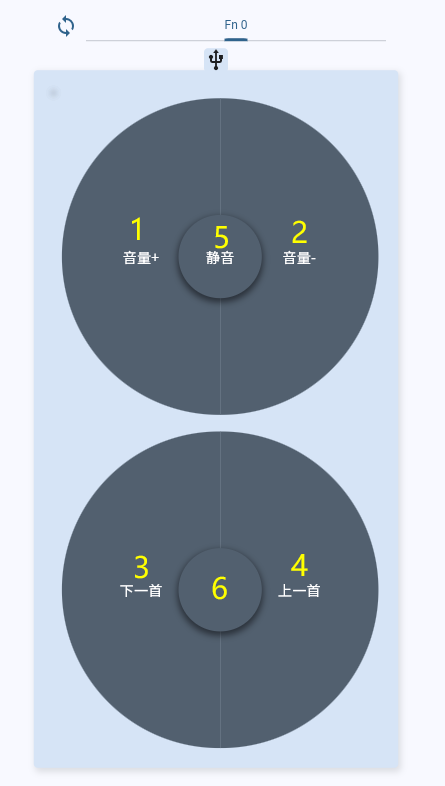

# Welcome to SayoDevice E1

> ## Interface Guide

1. Clockwise rotation
2. Counterclockwise rotation
3. Press and rotate clockwise
4. Press and rotate counterclockwise
5. Tap function (press and no rotation, trigger when released)
6. Press function (press to trigger. Generally not used, leave blank)

  

