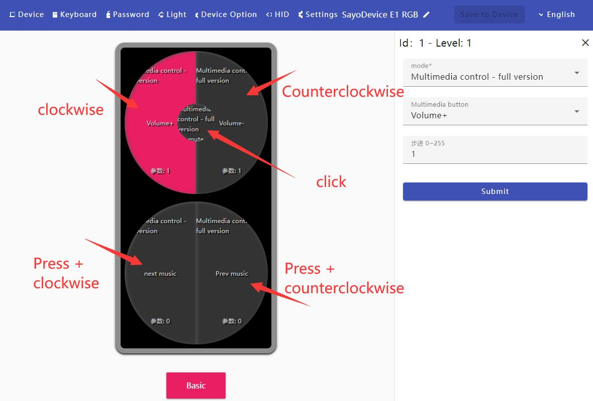

# Volume Controller (Knob) Documentation

### ☜ Documentation Menu <!-- {docsify-ignore} -->
*Use the menu on the left to navigate through the documentation*

> ## Software Access

### No Installation Required <!-- {docsify-ignore} -->
Simply open [https://app.sayodevice.com](https://app.sayodevice.com) in your browser to configure your device.

We recommend using [Chrome](https://www.google.com/chrome) or **Microsoft Edge** browsers for optimal compatibility.

### [Download Offline Version](https://dl.sayobot.cn/setting_v3.zip) <!-- {docsify-ignore} -->
*For users who prefer an offline installation*

---

> ## Configuration Interface
>
> 

---

> ## Basic Knob Functions

Your SayoDevice volume controller allows you to:

- Control system volume by rotating the knob
- Mute/unmute audio by pressing the knob
- Assign custom functions to the knob through the configuration software

---

> ## Custom Function Assignment

To customize your knob functionality:

1. Connect your device using a USB data cable
2. Open the configuration software
3. Navigate to the knob settings section
4. Choose from available functions:
   - Volume control (default)
   - Media playback control
   - Brightness adjustment
   - Custom keyboard shortcuts
   - Application-specific controls
5. Save your settings

---

> ## Adjusting Sensitivity

You can fine-tune how your knob responds to rotation:

1. Connect your device using a USB data cable
2. Open the configuration software
3. Navigate to the sensitivity settings
4. Adjust the rotation sensitivity to your preference
5. Save your settings

---

> ## Firmware Updates

To ensure optimal performance, periodically check for firmware updates:

1. Connect your device using a USB data cable
2. Open the configuration software
3. Check for available firmware updates
4. Follow the on-screen instructions to update if available

For additional support, please visit our website or contact our customer service team.
