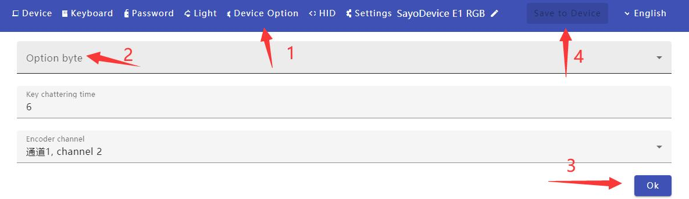

#Device options

> ### Setting process  

> ### Power-on startup delay

After turning on this option, the USB will be recognized after a delay of 0.5 seconds after being plugged in. Suitable for some slower computers.  
If the device cannot be recognized normally, try turning it on

> ### Enable Joystick

When this option is turned on, the keyboard can be recognized as a game controller by the game.  
This is an additional add-on and is only available on Windows. **Never** turn it on on mac system.  
Turn on **joystick** in the option byte to save and re-insert.  
Change button mode to **Game Controller**,  
Then select the button number.  
This button has nothing to do with any button on the game controller. The game needs to support custom buttons.  

> ### KVM Compatibility mode  

Deprecated, no need to pay attention  

> ### Disable lights

As the name suggests, turning this feature on will block the light.  

> ### surface dial mode  

Single knob only useful option.  
In Windows, you can set different functions for different software.  
After setting, you need to save and reconnect the data cable.  

> ### AZERTY Keyboard  

When this mode is turned on, one-touch passcode works on French keyboards.  
Do not enable this feature on other keyboards.  

> ### Key debounce time  

Release debouncing, the default value is 6, and it is generally not recommended to modify it.  
If the button is double-clicked, you can try increasing this value to more than 20  

> ### Encoder channel  

For options that are only useful for knobs, do not modify them.  