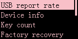
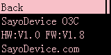
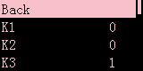
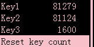
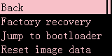

# Device Settings

> ## USB Report Rate
>
> Modify the device's report rate

---

> ## Device info
>
> Nothing to do here

- **HW**  
Hardware version (may be inaccurate)
- **FW**  
Firmware version (major version)

---

> ## Key Count
>
> Displays how many times you have pressed each key since the factory or last reset of the key count

- **Reset key count**  
Reset key count  

---

> ## Factory recovery
>
> Some reset operations

- **Factory recovery**  
(**will not reset key count**)

- **jump to bootloader**  
Enter firmware update mode
- **Reset image data**  
Clear custom images