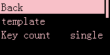

# Display settings

> ## Back light

### Standby light

If your computer **does not lose power to the USB after shutting down**, **turning on** this option will turn off the screen backlight of the small screen **after shutting down your computer**  

### Screensaver timeout

Set how long to display the sleep screen when idle

---

> ## Main screen

!> **!!!Warning: Selecting a template will overwrite your custom home screen settings!!!**

### Template->Default

Set the main screen to the default style preset by SayoDevice in your keyboard

### Template->bongocat

Set the main screen to the bongocat style preset by SayoDevice in your keyboard

### Key count

Select the key counter component on the main screen to display the keystrokes from the time to now

- **All**  
  Start from the factory or the last **Reset key count**

- **This time**  
  Count from this boot
