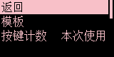
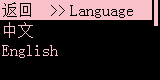

# Display

> ## Language 语言

**中文** Set built in menu Language to Chinese

**English** Set built in menu Language to English

---

> ## Backlight

### StandbyLight

If your PC/Mac **don't cut off USB power after power off** **turn on** this option to **turn off built in screen** after power off your PC/Mac

### ScreenSaver

Set time to show sleep screen if you don't use it

<small>~~set it in web or software will be much easier~~</small>

---

> ## Main screen  
**!!! important:choose any template will overwrite your custom main screen layout !!!**  
**!!! all key layer use same one screen layout !!!**

### template：default

Set screen to default layout

### template：bongocat

Set screen to built in bongocat layout

### key count

Set how to count key stoke of the counter shows on screen

**ALL** All key stroke from last time **reset key counter**

**single** key stroke will begin
