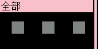

# Button

>## Calibration  
**Press and release as fast as possible while calibration**

**Press knob** to calibration all key  
**Rotate knob to select key than press knob** to calibration single key

---

>## Key stroke  
"RT" is Rapid Trigger  
That's mean key trigger or reset by certain **distance** pressed or lifted  
Recommend default settings for RT function in most situations

  

**Rotate knob to select key than press knob** to setting how trigger and reset each key

  
  
<small>in this two pictures，fixed height trigger/reset has be set to bottom/top of total travel，so it's not work</small>

**Trigger** fixed height trigger  **default 0.3mm**  
**Release** fixed height reset **default 0.2mm**

**RT Top** top dead zone of RT function, set to bottom to disable RT function **default 0.5mm**  
**RT End** bottom dead zone of RT function, set to top to disable RT function **default 3.8mm**  
**RT Trigger** in range of RT function(out of dead zone), trigger by how much distance pressed **default 0.2mm**  
**RT Release** in range of RT function(out of dead zone), reset by how much distance lifted **default 0.2mm**

<small>RT function will be disabled if RT Trigger longer than RT range(RT End - RT Top)</small>  
<small>RT function will be disabled if RT range = 0(RT End = RT Top)</small>
