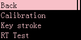
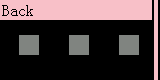
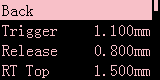
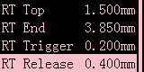
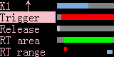

# Button settings

> ## Calibration

!> If the button is not reset to zero after release, or the button is replaced, please calibrate the button.

- **Press the knob directly**  
Calibrate all buttons
- **Turn the knob to select a single button and then press the knob**  
Calibrate a single button

---

> ## Key stroke (RT)
>
> RT is Rapid Trigger  
> Trigger or release the button by detecting a specific distance of pressing or lifting  
> It is recommended to use the default value for the RT function

**Turn the knob to select a button and then press the knob** to set the parameters of each button

- **Trigger**  
When the button is **equal to or greater than** the set position, the press operation is triggered.   
**Default value 0.3mm**  
Exception: If it is set to the RT range, it will not take effect  

!>This parameter is **absolute position**  
It is recommended to be at least 0.1mm larger than the **release** parameter  

- **Release**  
When the button is **equal to or less than** the set position, the release operation is triggered.   
**Default value 0.2mm**  

!>This parameter is **absolute position** and has the **highest** priority.   
It is recommended to be greater than 0.1mm, otherwise it may not be released (due to shaft tolerance or shaking, etc.)

- **RT range**  
Within this range, RT is actived   
**Default value 0.5mm ~ 3.8mm**

!> **It is not recommended** to set the RT range to a position greater than 3.8mm  
(because the shaft shaking may not be pressed to the bottom, which may cause incorrect release)

- **RT trigger**  
Within the RT range, the cumulative press of the button is equal to or greater than the set distance to trigger the press operation   
**Default value 0.2mm**

!>This parameter is the **relative length**, relative to the position of the last trigger release  
It is recommended to be greater than 0.1mm

- **RT release**  
Within the RT range, the cumulative release of the button is equal to or greater than the set distance to trigger the release operation **Default value 0.4mm**

!>This parameter is the **relative length**, relative to the position of the last trigger press  
It is recommended to be greater than 0.2mm

> ## Disable RT
>
> You can set RT Set Trigger / RT Release to a value greater than RT Range to disable RT

> ## Visual Adjustment
When adjusting the parameter value, press the corresponding key, and the indicator bar at the top of the screen will show the real-time key status

> ## Special Cases
>
> To be edited