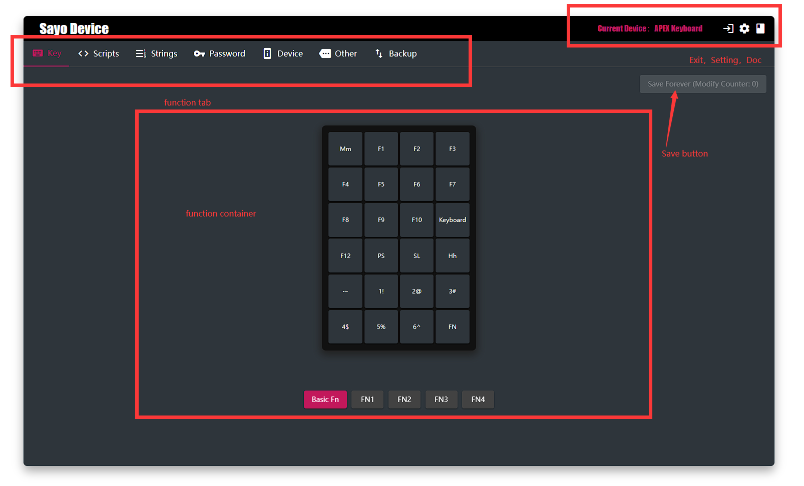

# Start

>This isthe documentation for the SayoDevice.

## Explain

- Most changes take effect immediately, but remember to click Save button before disconnecting.
- Some changes take effect after need to be saved and reconnected to the device, such as rename device.

