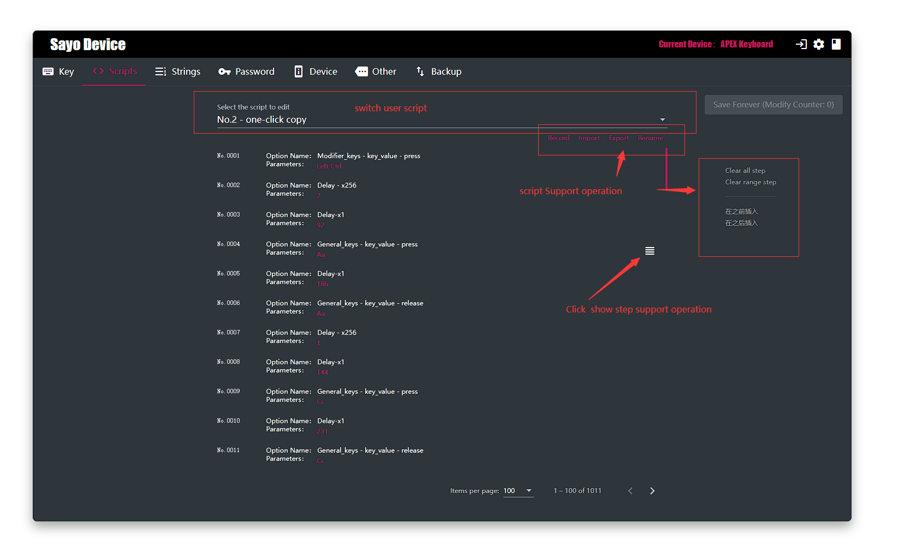
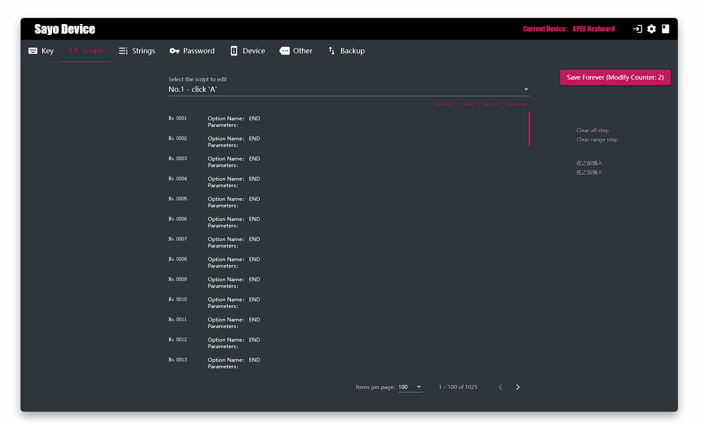
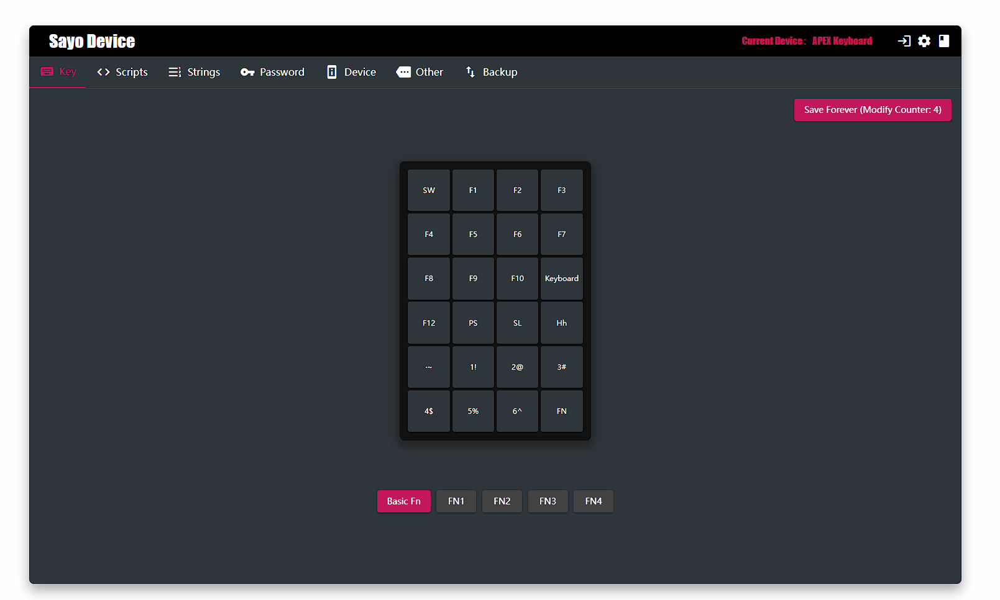
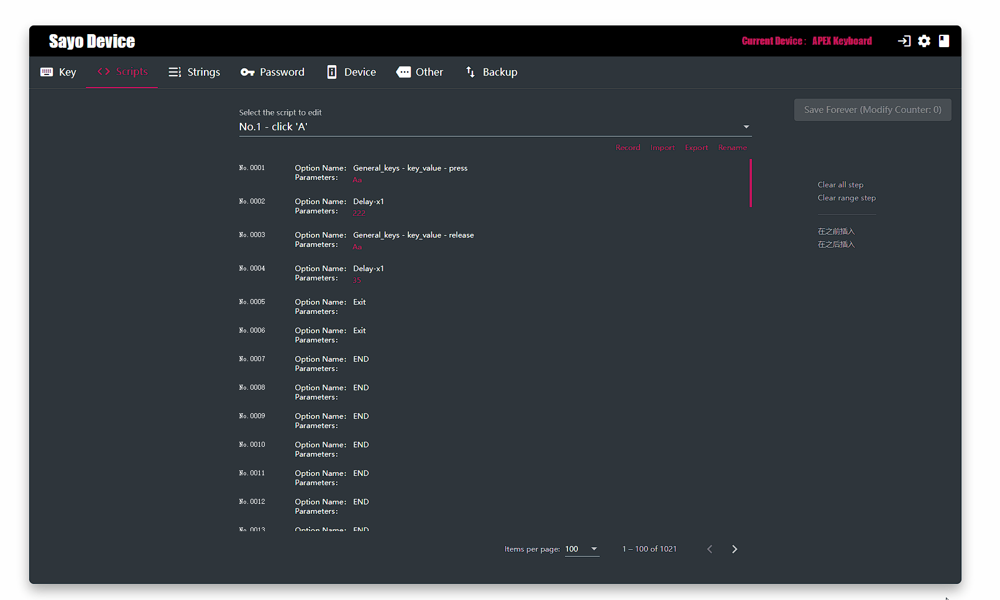
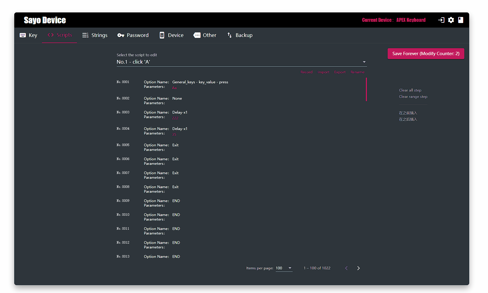

>Some steps to perform, need a button trigger

**PS: take effect after saved**

## Support

- Reanme current script 
- Import
- Export
- Record key click

## Example: Auto click 'A'

1. No.0001: Press 'A'
2. No.0002: Wait 128 ms
3. No.0003: Release 'A'
4. No.0004: Wait 35 ms

## Example：Record and generate script

If your script steps are just a few simple key click, you can use the recording function to generate them automatically. Now how to use recording to generate a "select all text and copy" script steps.

## Example：Delete and add a step

## Example：Rename current script

