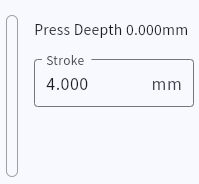

## Calibration  
Full calibration can be performed on the webpage, or individual calibration can be done after selecting a key.  
The calibration process will automatically fit the magnetic curve to achieve reasonable precision.  

## Basic Parameters  

!> **-Trigger -Release -RT Trigger -RT Release** are four distinct parameters. Please note!  

### Key Travel  
Correctly set the key travel of the switch; otherwise, precision may not be achieved.  
Refer to the product specifications of the switch for specific parameters.  
  

### Trigger Point and Release Point  
These parameters are fixed positions.  
The Trigger Point must be greater than the Release Point.  
Recommended value: **above 0.3mm**.  
  

#### Trigger Point Activation Conditions (meet one of the following):  
After meeting the conditions, pressing beyond the Trigger Point will activate the key.  
- RT disabled  
- RT enabled but Global RT disabled, and the Trigger Point is outside the RT range  
- RT enabled with Global RT enabled  

#### Release Point  
Recommended value: **above 0.2mm**  
- The key will always release within the **0-x range**.  

### RT Trigger and RT Release  
These parameters are **relative lengths**, not absolute positions.  
**RT Release** cannot be smaller than **RT Trigger**. Incorrect settings will auto-reset.  
Recommended practical value: **no less than 0.1mm**.  
  

## Global RT(Full stroke)  
When Global RT is enabled, the key immediately enters RT state **after passing the Trigger Point** and remains until returning to the **Release Point**.  

### RT Match  
With Global RT enabled, the RT Match function becomes available.  
This function eliminates key chatter without adding latency.  
Recommended value: **30 to 60**.  
For spacebars or keys using **stabilizers**, set to **maximum**.  
  

**Principle**: When a key bottoms out and rebounds, a timer starts (16KHz decrement).  
Key chatter during the timer period is ignored.  
After the timer ends, the current depth is used as the new RT reference.  

## Key Dynamic Curve  
Select a key and press it to display its depth and status.  

## Multi-Sampling  

!> This setting affects latency, but current magnetic axis testers may not detect it.  

Provides a **speed vs. precision** option.  
Minimum: **0.0625ms** | Maximum: **~2.5ms**  
Recommended value: **10**.  
