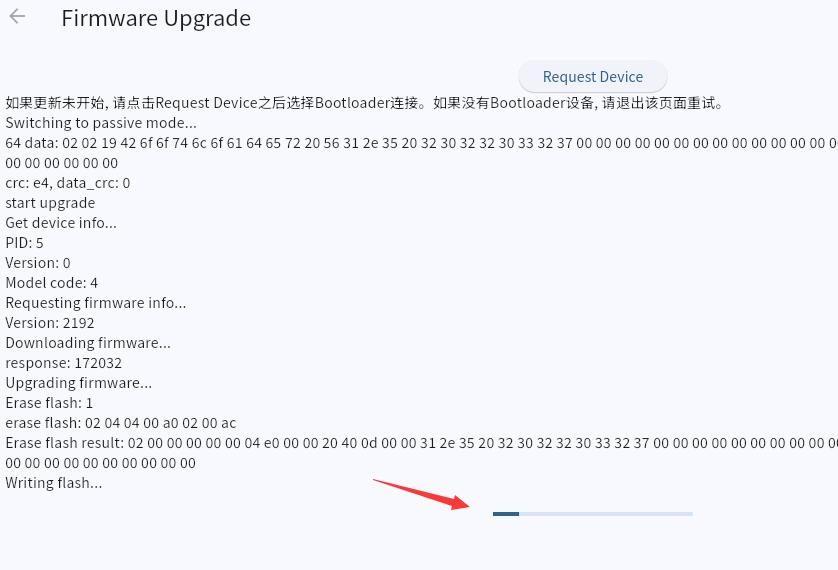

> ## Firmware Update

!> If there is a problem, please refresh the page and try again, do not unplug the device!

1. After connecting the device, if there is content that can be updated, it will pop up a notification  

2. Click **Update** on the update window  

3. For the first upgrade, you need to manually search for the device. Attention the info on the page, select the device with **"Bootloader", ** **"BL DEV"** and other words.  
After the connection is successful, it will automatically upgrade, just wait for the progress bar to run.  
