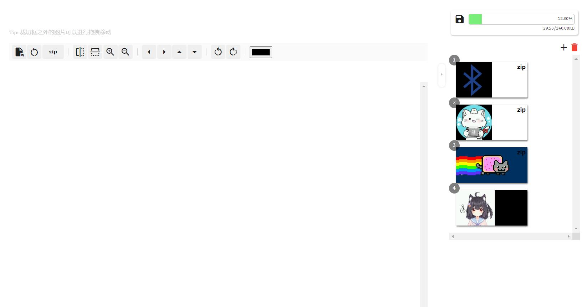
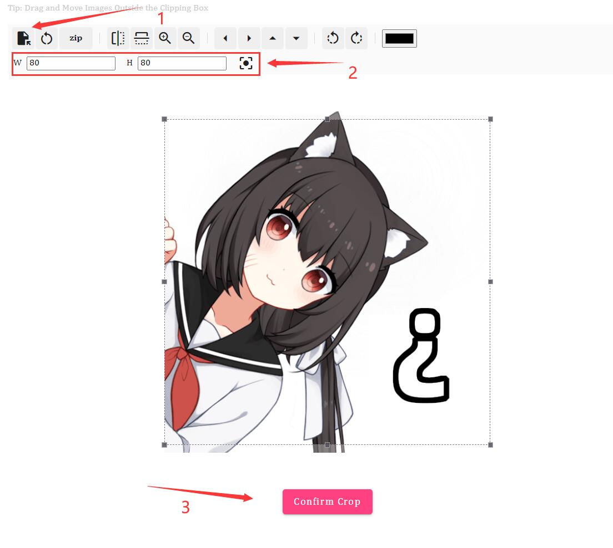
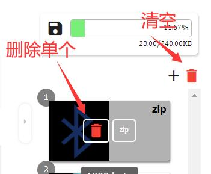
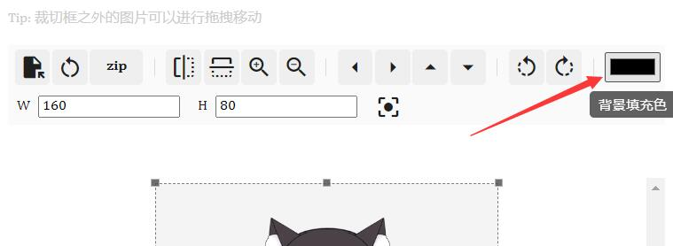

## Image

!> Only some devices with screens  
This function is used to upload and manage resources such as images

## Start

---

## Add

1. Click the Add button and select an image  

2. Adjust the resolution size or ratio options  

3. Confirm the crop and save to the device  

---

## Delete

Click the Delete button on the image.  

---

## Compression

Due to device space limitations, compressing images can save space.  
Switch to zip in the **Edit toolbar** or click the **zip** button above the **Device image** to turn compression on and off  

  

---

## Transparent Background

Transparent images are not currently supported.  
But you can change the background color of the transparent area of ​​the image  

  

---
