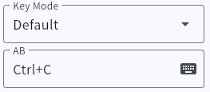
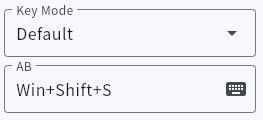
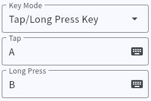
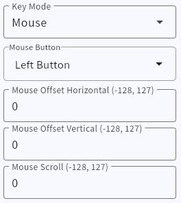
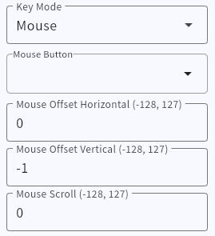
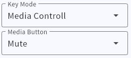
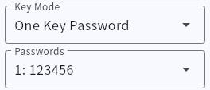

# Key Function

> # Set Keys

1. Select **Default** for Key Mode,  

2. Click the box below to select keyboard keys  

- **Ctrl Shift Alt Win** You can **not select, select one or more**.  
- **Other keys** can **not be selected or selected**  
- Click the key again to deselect

<font size=5>Give a few examples</font>

- **Set A**  
  

- **Set Ctrl key**  
  

---

> # Set shortcut keys

- **Set copy shortcut key Ctrl+C**  


- **Set screenshot shortcut key Win+Shift+S**  


---

> # Set two sets of consecutive key operations

!> In this mode, one set of shortcut keys is executed after pressing, and another set of shortcut keys is executed after releasing the key

1. Select the button mode **two-step operation**,  
2. Set two groups of buttons, the method is the same as above  
 
- **Set one-key paste + enter**  


---

> # tap or hold

!> This mode is not compatible for knobs

1. Select the button mode **tap or hold**,
2. Then set two groups of buttons, the method is the same as above

- **Set tap A and hold B**  
  

- **Set tap to pause and hold to next song**  
  

---

> # Mouse mode
>
> In this mode, you can set a button as **mouse left button, mouse right button, scroll wheel press** or **cursor moves up and down, left and right, scroll wheel up and down**

- **Set mouse left button**  
In **mouse button** Select a button in the Options box. Set the following three values ​​to 0  


- **Set cursor down**  
In the **Mouse Button** option box, cancel all buttons, and then fill the **Mouse Move Y** input box with -1   
  

- **Set wheel down**  
In the **Mouse Button** option box, cancel all buttons, and then fill the **Scroll** input box with -1  

```
X positive number moves right, negative number moves left  
Y positive number moves up, negative number moves down  
Roller positive number rolls up, negative number rolls down  
The larger the value, the faster the movement speed  
```

---

> # Multimedia Control  
>
> Control system volume, switch songs, screen brightness, etc.  
> _Screen brightness function is only suitable for laptops or some screens that support brightness adjustment in the system_  
> _Step parameter is multiple execution, set to 1 to execute once, 2 to execute twice. 0 will also be executed once_  

- **Set mute switching**  


---

> # Keyboard + LED control  
>
> _The shortcut key can be unselected to achieve the effect of only switching the light state_  
> _Including Num lock, CapsLock, Scroll Lock_  

!> _This mode will also trigger the indicator-related keys to update the corresponding status before and after the shortcut key is triggered_  

- **Turn on the numlock indicator and turn off the capslock indicator**  


---

> # A+B+C+D  
>
> _This mode can press the selected keys in sequence and then release them_  
> _Applicable to shortcut keys that require strict control of the key sequence, or shorter key sets. _  
> _Select up to 4 keys_  

---

> # One-click password
>
> _In this mode, you can enter the preset ASCII string in sequence_  
> _You can choose to add an arbitrary key after the string, such as Enter_  
> _You can customize the input interval (milliseconds) and lock case options_  
> _If the input content is different from the setting, you can try to enable the lock case function. After turning it on, the input content will not be affected by the input method. _  
> _For French keyboards, please change the key layout in Settings_  

- **Set one-click input ABCdef123 and then Enter**  

1. Enter the content in **Password Book**  
  

2. In **Keys**, change the key mode to **One-click password** and select the saved password number  
  

- Additional keys
You can insert an arbitrary key after the password, such as Enter.  

- Input interval  
Password input speed, in milliseconds, default value 2.  
Generally no need to modify. If you find that you miss keys when inputting, you need to increase this value  

- Lock uppercase and lowercase  
Automatically lock the keyboard uppercase when entering the password. After turning on this function, the password input will not be affected by the input method.

- Other keyboard layouts  
The default keyboard layout is ANSI. If you need to change to AZERTY layout, please click "Device Options" to turn it on  

---

> # One-click web page  
>
> One-click to open the set URL  

!> Some devices do not support this function  

Applicable to Windows system  
Setting method same key password  

---

> # One-click poetry  
>
> One-click to output a string of text  

!> Some devices do not support this function  

!> ** There may be shortcut key conflicts. **  
Function principle:  
Press Alt+Number keys on the small numeric keyboard to directly enter the character code.  
Applicable to Windows system  

The setting method is similar to one-key password, but enter the content in the **string** tab  

Supports two encoding methods (GBK\Unicode)  

Different software may require **different** encodings. If you enter garbled characters, you can **switch to another encoding**  

---

> # shortcut \*3  

!> Some devices do not support this function  

In this mode, you can type three shortcut keys continuously, such as **select all+copy+switch tab card (Ctrl+A Ctrl+C Ctrl+TAB)**  

---

> # Cycle input  
>
> You can select 1~3 keys. When you hold down the keys, press them in sequence.   
> Release the keys to stop  
> Cycle interval n\*6 ms  

- **Cycle down direction+space**  
  

---

> # joystick button  

!> This is an additional add-on and is only applicable to Windows. Do not enable it on Mac system.  
If enabled by mistake, use Windows system to turn it off.  

In the device options, turn on the HID function of **joystick**, save and re-insert,  
Change the button mode to **game controller**,  
Then select the button number.  
This button has nothing to do with any button on the game controller, and the game needs to support custom buttons.  

---

> # key to axis
>
> This mode can map a linear key to a joystick signal (need to enable device function: controller)  
> or mouse cursor movement (need to enable device function: relative mouse)  

!> Some devices do not support this function  

- Axis  
Optional X Y Z rX rY rZ  
- mouse X Y  
Two direction axes of the mouse  

- Alignment  
Optional left alignment, right alignment, center left alignment, center right alignment  

---

> # Numlock virtual multi-layer  

!> _This mode is only applicable to devices whose hardware does not support FN layer_  
_For devices that support FN layer, please use FN function_  

- **When the number lock is turned on, the key is A, and when it is turned off, the key is B**  
  

---

> # Key layering (FN)  

!> Some devices do not support this function  

1. Change a key mode to **FN** and select the target layer to switch to  
2. Press this key and the keyboard will switch to another layer of functions  
3. Release this key to return to the original layer  

  

---

> # Key Layering (SW)  

!> Some devices do not support this function  
 
Similar to the FN function, but it will not return to the original layer when the key is released  

> # Bluetooth Multi-device Switching (BLE_SW)  

!> Some devices do not support this function  

Only Bluetooth mode is valid  

- Set a key to quickly switch devices  

- If the device is not online, it will automatically enter pairing mode (white LED flashes)  

---