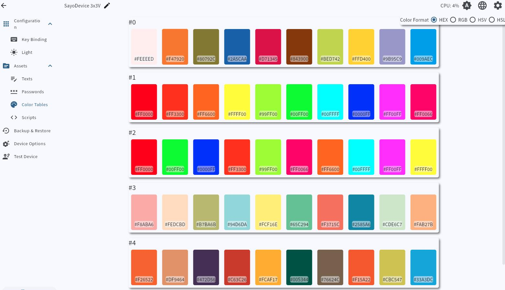

# Color palette
!> Only some devices support this feature

The color palette is used to manage multiple color tables and cannot be used alone. It needs to be used with the lighting option

You can modify it by simply clicking on the corresponding color block

When modifying, click the **pipe icon** to **select the color on the screen**

