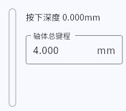
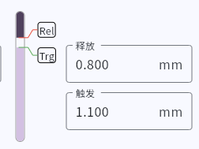
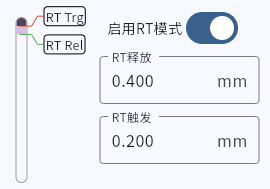
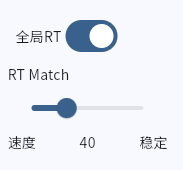

## 校准  
在网页里可以全部校准，或者选中按键后单独校准  
校准按键会自动拟合磁力曲线，达到一个比较合理的精度  

## 基本参数  

!> -触发点 -释放点 -RT触发 -RT释放 是四个不同的参数，请注意！

### 键程
请正确设置轴体键程，否则可能无法达到精度  
具体参数可以查看轴体的商品详情  

### 触发点和释放点  
此参数是固定点  
触发点必须大于释放点  
建议值 0.3 以上
  
#### 触发点生效条件（满足其一即可）  
满足条件后，按下超过触发点即可触发按键。
- 关闭RT
- 开启RT，但不开全局RT，且触发点不在RT范围内
- 开启RT并开启全局RT  

#### 释放点  
建议值 0.2以上  
- 在 0-x 这个范围内无论如何都会释放  

### RT触发和RT释放  
此参数是相对长度，非绝对位置。  
RT释放 不能小于 RT触发，设置错误会自己还原  
实际使用建议不低于0.1mm  

## 全局RT
开启全局RT时，按键**经过触发点**后立即进入RT状态，直到回到**释放点**为止  

### RT match  
开启全局RT后，可以使用RT match功能。  
此功能可以消除按键抖动，且不会增加延迟  
建议设置值为**30到60**  
空格或者其他使用**卫星轴**的按键可以**拉满**  

原理：当按键按到底反弹时，进行一个计时（16KHZ递减）；  
计时期间的按键抖动会被忽略；  
计数结束后，以当前深度作为下次RT的基准。  

## 按键动态曲线  
选中一个按键后，按下按键即可显示按键的深度和状态。

## 多重采样  

!> 这个设置虽然会影响延迟，但是目前所谓的磁轴测试器不太能测的出来   

提供一个 速度-精度 的选项  
最低0.0625ms 拉满大概最高2.5ms  
建议值10  