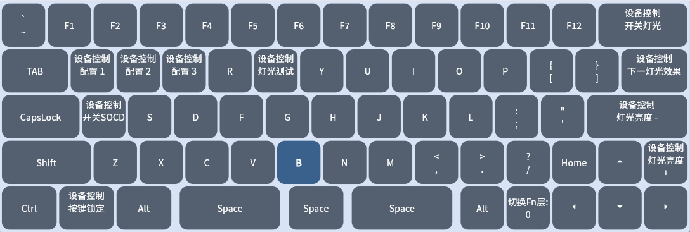

## 默认快捷键

### 默认的FN层功能 <!-- {docsify-ignore} -->
按住FN键后即可使用快捷键
> K64H3 K64H3MZ K66H3MZ

> K61H3MZ 

## 其他快捷键
### 恢复出厂设置 ：
长按3秒  ESC + 键盘最右下角的键  
- ESC+方向右（64/66键）  
- ESC+FN（61键）    

### 校准全部按键 ：
长按3秒  ESC + R + 键盘最右下角的键  
- ESC+R+方向右（64/66键）  
- ESC+R+FN（61键）    

## 设置/修改快捷键功能
请使用网页修改，在网页的按键设置里选中FN1层修改功能即可。

## FN层灯光提示  
- 按下FN后，与主层不同的快捷键会亮起提示。
- 灯光颜色可以在网页的灯光选项卡修改
- 如果不需要提示，请设置成黑色即可（#000000）