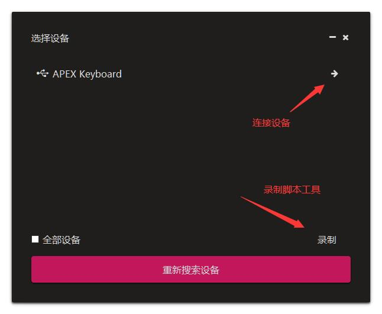
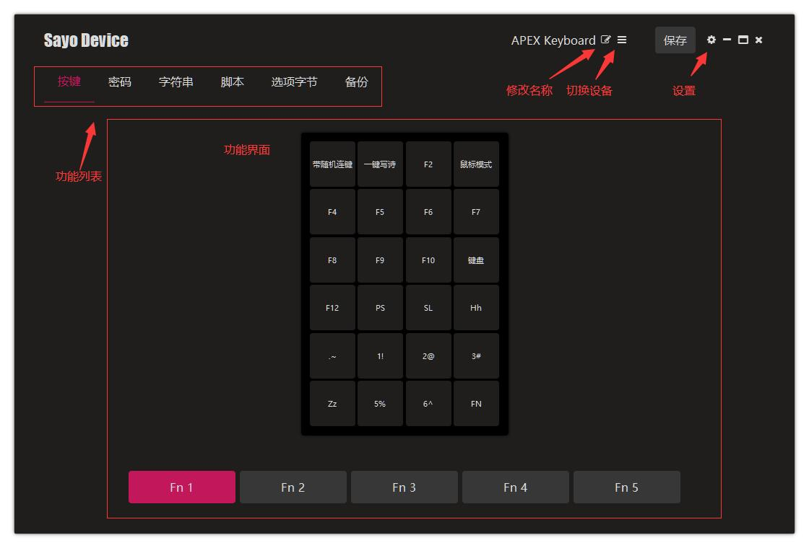
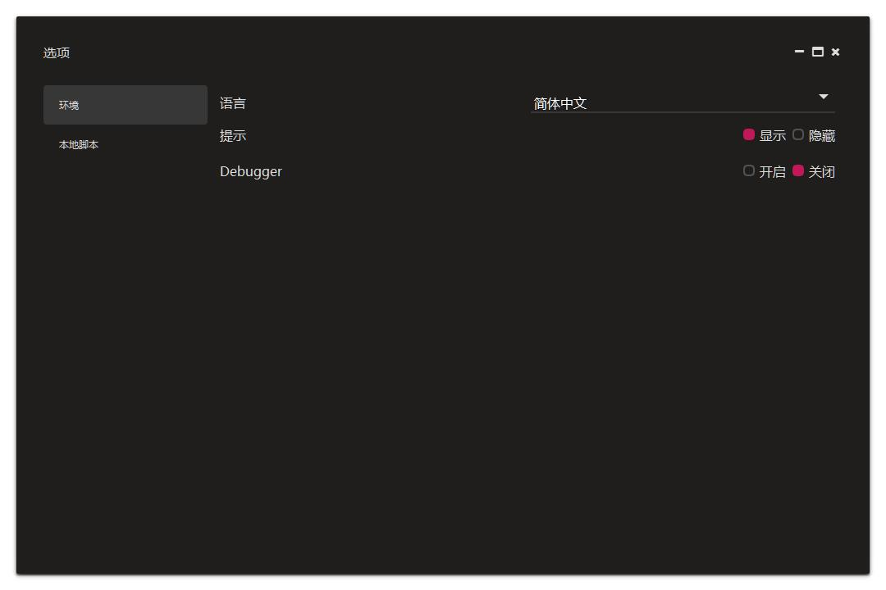

# 简介

这是关于 SayoDevice 控制程序桌面版的说明文档，基于版本 v0.11.327。

> 大部分更改都是马上生效，但是需要点击界面右上角的 **永久保存** 才会保存到设备当中，直接拔掉数据线就回到未保存的设置。  
个别更改需要保存并重新插拔数据线才能生效，例如修改设备名称、设备HID功能。

### 功能速览

这里只是简单的说明一下功能，详情请到对应功能的页面查看，不同的设备界面上会有一些不同，例如一些设备不支持灯光的话就不会有灯光界面。

#### 选择设备



- 选择或者切换设备
- 在不连接设备下录制脚本

#### 主界面




- 顶部标题栏：修改设备名称、切换设备、永久保存按钮、打开设置。
- 按键：按键其实就是一个触发器，可以根据选项单独使用，也可以配合其他功能使用，例如通过按键来触发脚本功能。一些选项可以看成内置脚本（不同型号设备的按键显示也会有差异）。
- 密码：需要通过按键触发，界面内只用于管理密码。
- 字符串：需要通过按键触发，界面用于管理字符串。
- 脚本：需要通过按键触发，脚本就是一系列的可执行动作，包括基本的鼠标、键盘和设备的灯光控制等等。
- 灯光：用于控制设备灯光的显示方式。
- 调色板：需要配合灯光使用，提供多组的色表。
- 选项字节：其他的功能，例如记录屏幕分辨率，同其他功能配合使用。
- 触摸：可触摸设备独有，修改每个按键的灵敏度。
- 备份：用于将设备的设置备份或者回复，也方便用到其他设备。
- 内置脚本：当前不是很完善，不能编辑，通过脚本右键来插入。内置脚本就是我们对于一些常用的脚本的预设，可以用设置界面的本地脚本替代。

#### 设置



- 环境：一些通用设置，例如语言，提示和debugger 开关。
- 本地脚本：本地脚本同主界面的脚本功能一致，区别是不会写入设备，因此没有数量的限制，建议用来保存短的脚本，形成一个脚本库，形式上会保存为 json 文件，每个 json 是一个脚本集，每个脚本可以有任意步骤。

### 安装与启动

+ **Windows**  
解压压缩包后直接双击运行 SayoDevice.exe 即可。

<!--
+ **Linux**  
打开命令行工具，移动到根目录，使用管理员权限运行：  
```bash
sudo ./SayoDevice
```

+ **macOS**  
macOS 需要先安装：  
1. 双击打开 SayoDevice.dmg，右键“访达”新建一个“访达”窗口  
2. 将打开的 SayoDevice.dmg 中的 SayoDevice.app 拖拽到“访达”窗口侧边栏的“应用程序”  
3. 推出 SayoDevice.dmg  
然后就可以通过命令行启动：  
>PS: 拖拽文件到终端.app 的窗口可以直接获得路径，省去从终端移动到文件目录的步骤。  
```bash
sudo ./SayoDevice_mac.sh
```
-->