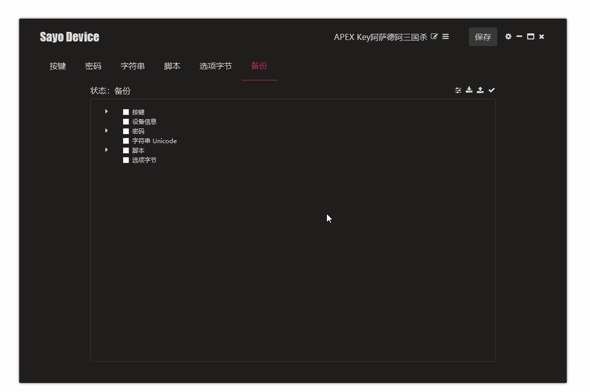
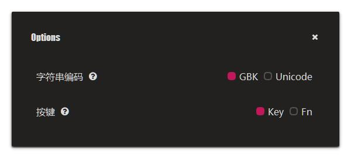

# 备份管理

有时候我们需要将某个设备的设置备份，然后导入到另一个设备当中，或者防止设备数据地址等。

### 设置备份

1. 选择备份模式
2. 选择要备份的数据
3. 确定并导出

### 恢复备份

1. 点击恢复模式来导入文件
2. 选择要恢复的数据
3. 确定并开始恢复

### 选项

个别内容可以通过修改选项面板来获得不同的备份方式。

- 字符串编码：选择字符串备份的编码方式
    - GBK
    - Unicode
- 按键：选择按键备份方式
    - Key：以按键为单位进行备份，例如只备份第1,2个按键设置
    - FN：以 FN 层为单位进行备份，例如只备份全部按键的第 1 层设置