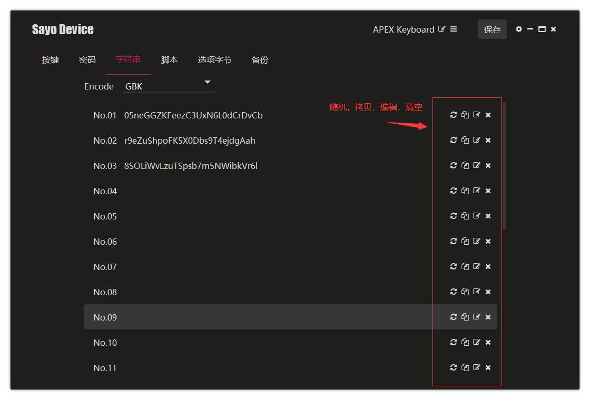

# 字符串 & 密码

密码和字符串的面板用于管理内容，需要配合按键面板来触发。

1. 在密码或字符串面板进行编辑
2. 在按键面板点击要设置的按键来打开选项面板
3. 选择模式为“一键写诗”，并选择对应编号的字符串
4. 点击实体按键输出内容

>需要注意一点，字符串比密码多了切换编码的功能。如果在某个编码下输出乱码，请切換至其它编码然后重新编辑内容再做尝试。

### 功能说明

- 编码：Unicode 或者 GBK
- 随机：随机生成 27 个数字和字母组成的字符。
- 拷贝：拷贝到系统剪贴板
- 编辑：最多 28 个 ASCII 码，对于 O2C 会和设备名称冲突
- 清空：清空选中的行

