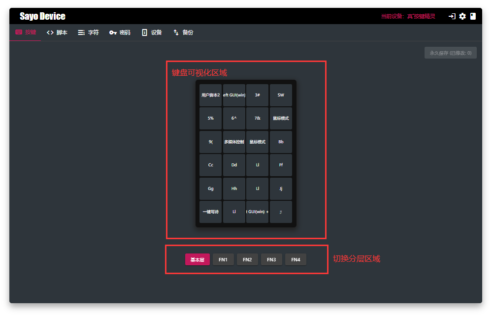
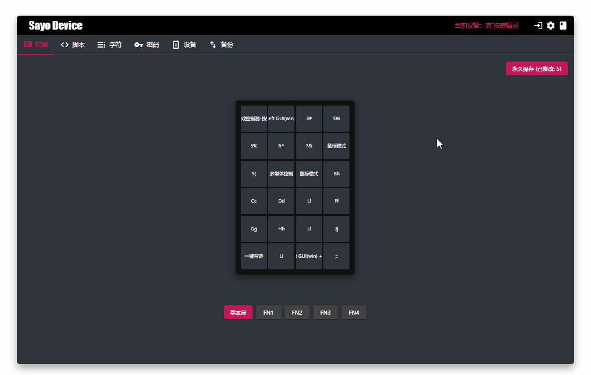
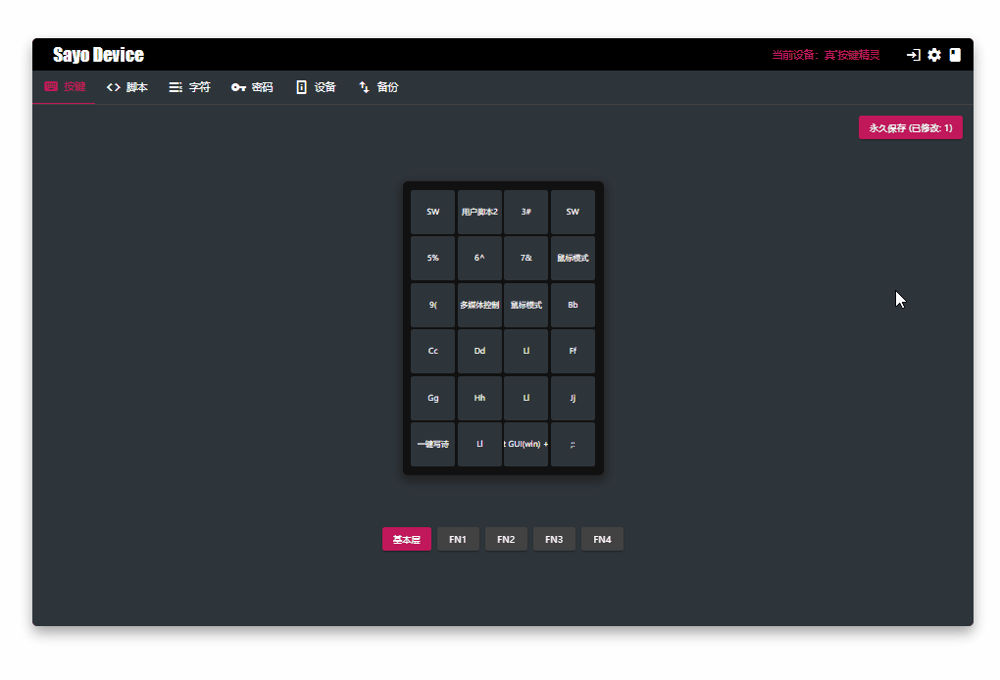
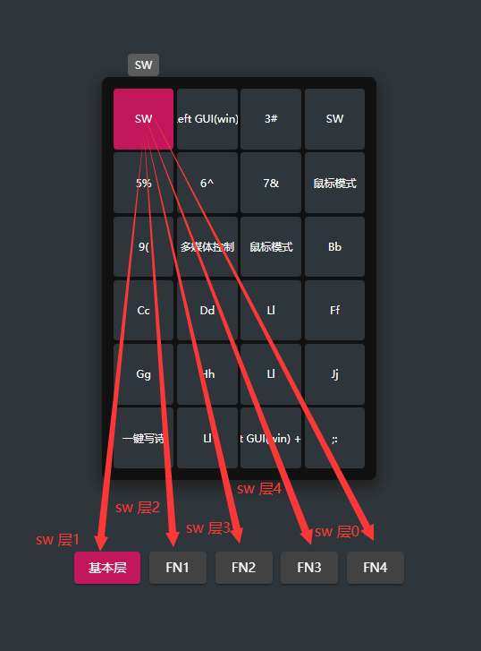

按键设置是 Sayo Device 的主要内容，通过对单个按键设置来将原本复杂的操作简化为一个按键，例如一键输入密码或者字符串，一键执行脚本来进行复制全选、复制等功能，并且一些设备还支持多层设置。

## 界面预览

## 示例：一键输入密码

对于一些密码我们并不想繁琐的输入，也不想记忆，通过按键设置就可以简化这个过程，仅需要两步

1. 设置按键模式为一键密码。
2. 到字符管理界面编辑对应的字符。

## 示例：一键全选文本并复制

通过按键设置和脚本来执行全选当前文本并复制到剪贴板

1. 设置按键模式按键  **用户脚本1**（或者其他编号脚本）
2. 设置脚本具体的步骤（教程 - 脚本管理 - 示例：录制一键复制）

## 示例：多层按键设置

对于支持多层按键的设备，我们可以将其中一个用来指定为专门切换按键层，例如 4*6 键盘的左上角第一个按键，在 基本层将其指定为切换到层1，在层1指定为切换到层2，依次类推，这样就可以形成循环，只通过一个按键切换不同分层。

