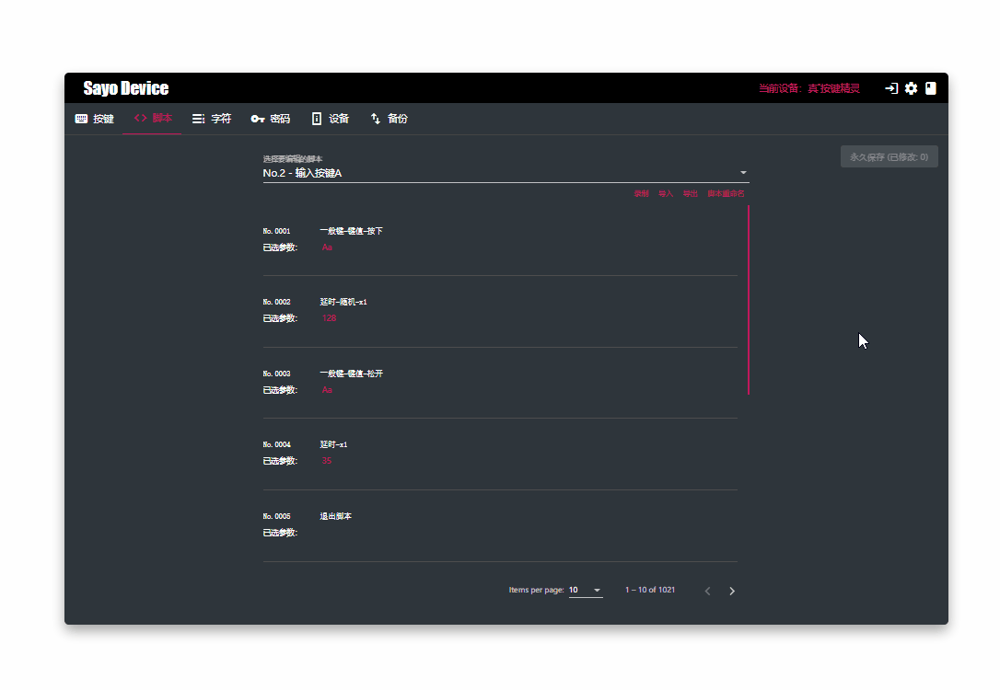
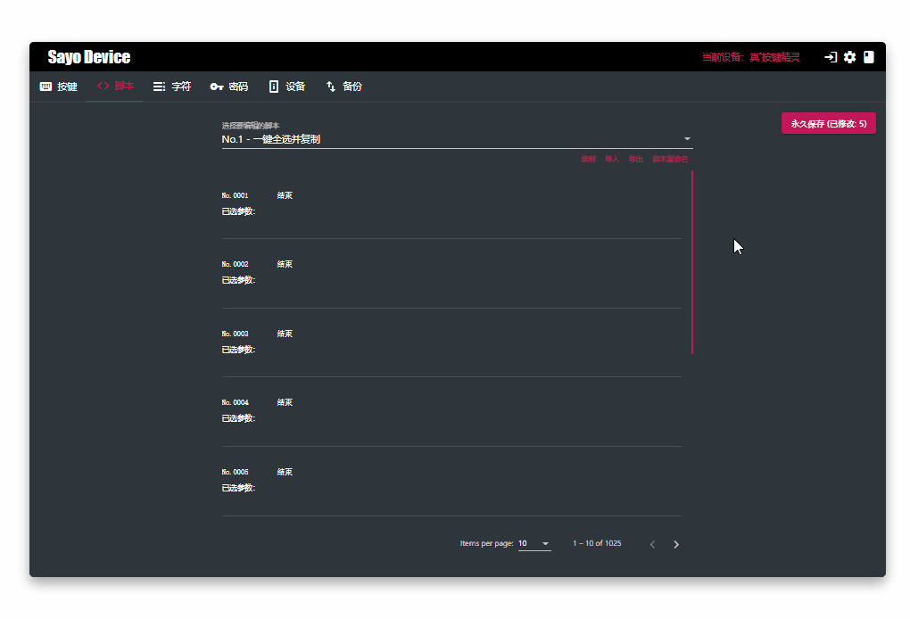
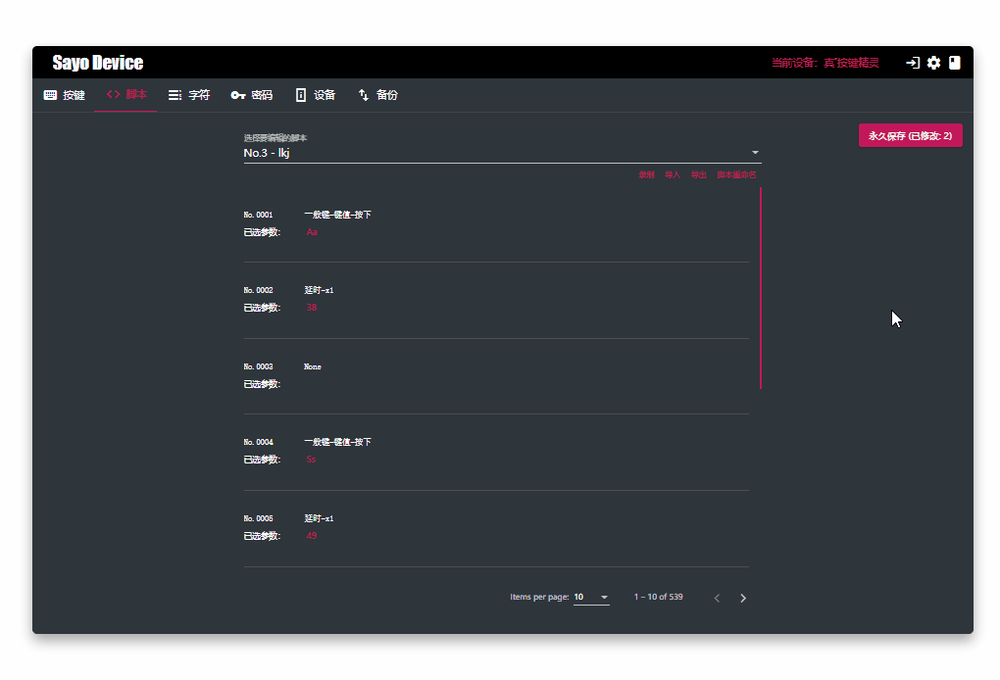
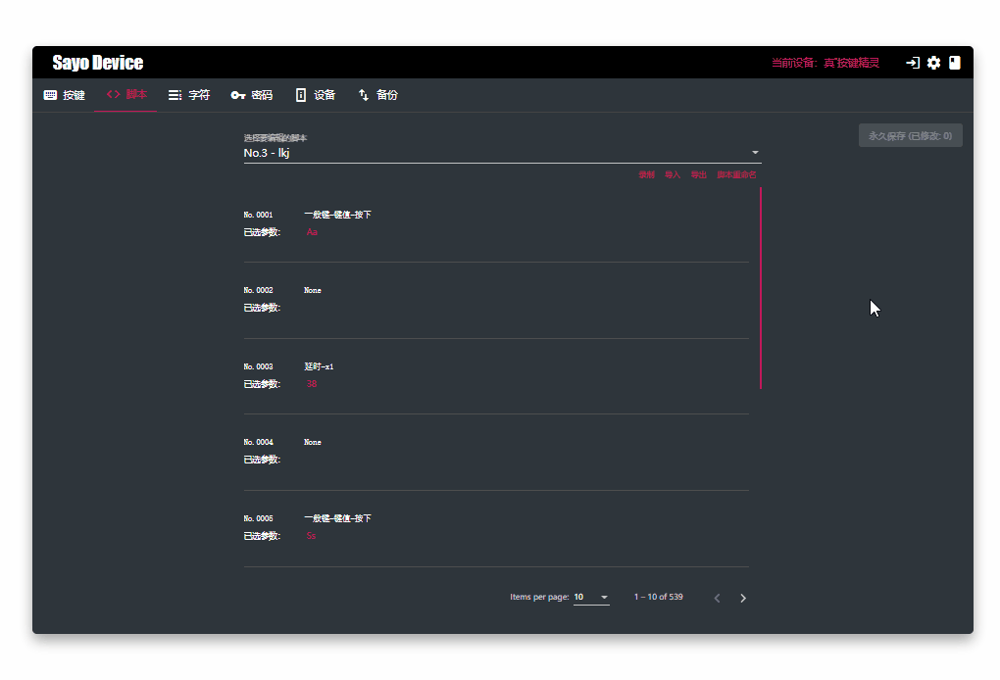

需要配合按键设置使用，通过按键的用户脚本模式来触发脚本执行，脚本是一系列自动执行的步骤

## 界面预览

**注意：脚本必须永久保存才能生效**

## 支持的操作

- 脚本命名：通过给脚本命名来明确该脚本的功能
- 导入、导出：脚本可以单独导入导出
- 录制：一些简单的按键行为可以直接通过录制来简化

## 示例：自动输入按键

触发脚本并输出字母 A，以下是已经写好的步骤。

1. No.0001: 按下按键 A
2. No.0002: 等待 128 毫秒
3. No.0003: 松开按键 A
4. No.0004: 等待 35 毫秒

## 示例：录制一键复制

对于一些仅需要按键的操作，一个个脚本设置太过麻烦，幸运的是你可以使用录制功能，以下演示如何录制一个一键全选并复制到剪贴板的脚本步骤：

## 示例：动态删除，增加步骤

## 示例：重命名脚本

