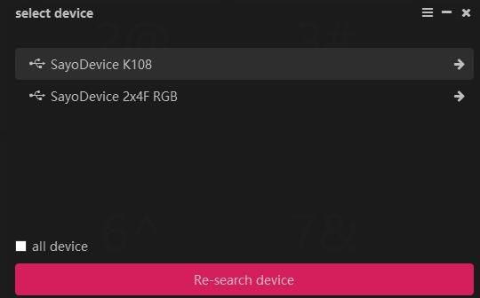
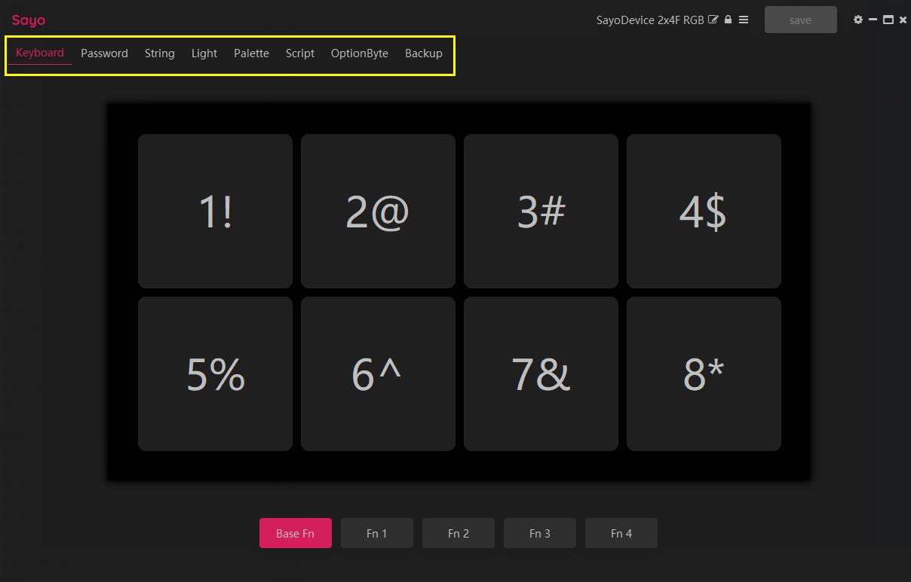

# Introduction

This is the documentation for the desktop version of the SayoDevice control program, based on version v0.14.42.

> Most changes take effect immediately, but you need to click **Save** in the upper right corner of the interface to save them to the device; unplug the data cable directly to return to the unsaved settings.
Some changes need to be saved and re-plugged and unplugged to take effect, such as modifying the device name and device HID function.

### Feature overview

Here is just a brief explanation of the functions. For details, please go to the page of the corresponding function. Different devices will have some differences in functions. For example, if some devices do not support lighting, there will be no lighting tab.

#### Select device

- Select or switch devices (click "**→**" icon)
- Record scripts without connecting to a device

#### Main page

- Top title bar: Modify device name, switch devices, save button, open settings.
- Keyboard: A button is a trigger that performs a set function after pressing the button, such as sending a button.
- Password: Need to be triggered by key press. The tab is only for managing passwords.
- String: Same as above.
- Script: needs to be triggered by key press. A script is a series of executable actions, including basic mouse, keyboard and device lighting control, etc.
- Light: Used to control the display mode of device lights.
- Palette: It needs to be used with lighting and provides multiple sets of color tables.
- Option byte: other functions, such as recording screen resolution, used in conjunction with other functions.
- Touch: Unique to touch-enabled devices, modify the sensitivity of each key.
- Backup: Used to back up or restore device settings, and also convenient for use on other devices.

#### Settings page

- Environment: some common settings such as language, prompts and debugger switches.

### Installation and startup

+ **Windows**
Unzip it and just double-click to run SayoDevice.exe.