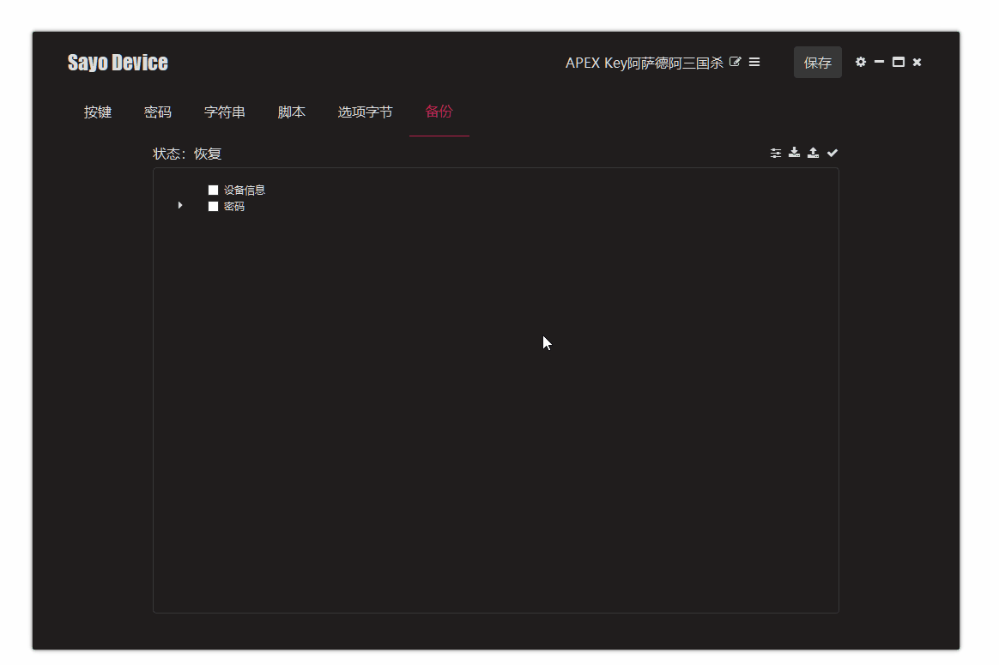
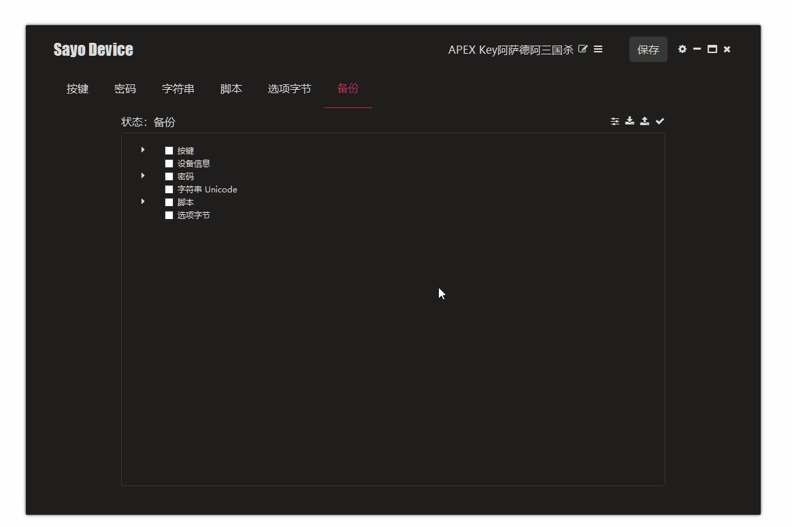

# Backup management

Sometimes we need to back up the settings of a certain device and then import them to another device.

### Set up backup

1. Select the Backup tab
2. Select the data to back up
3. Confirm and export

### Restore backup

1. Click Recovery Mode to import files
2. Select the data to be recovered
3. Confirm and start recovery

