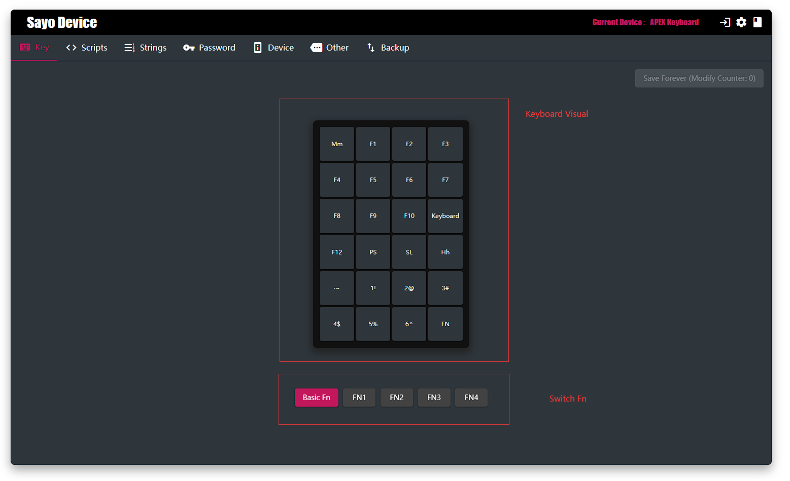
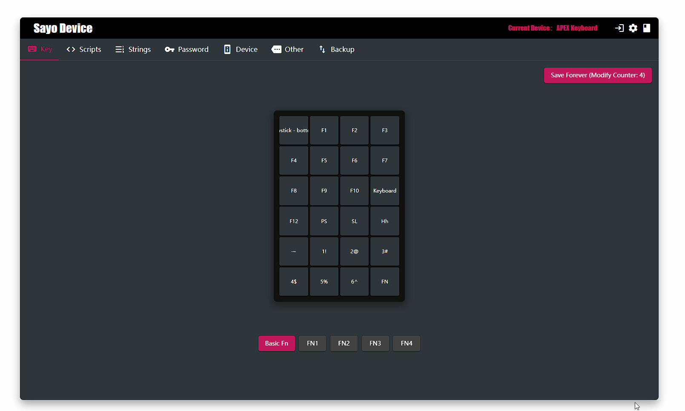
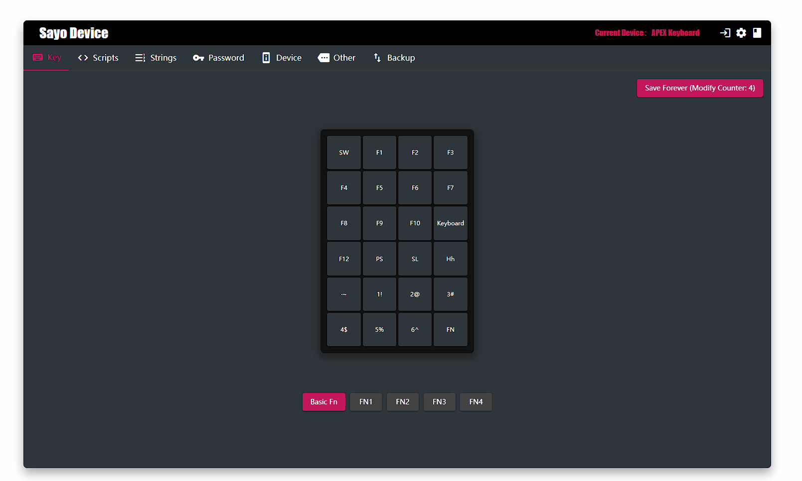
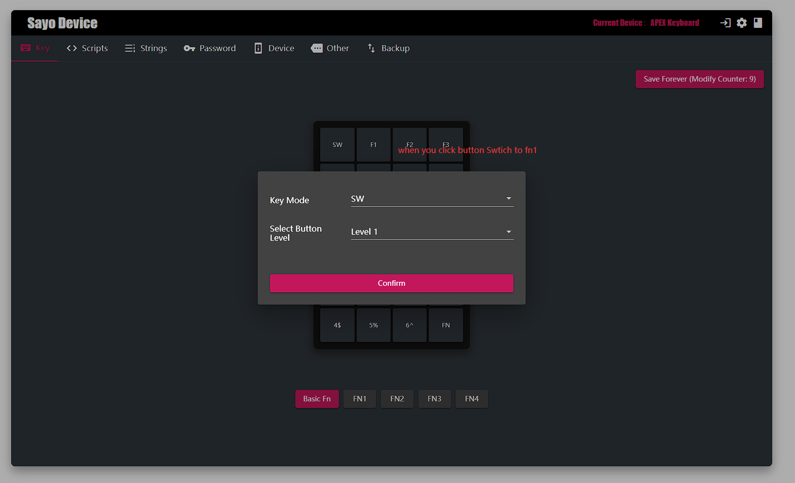

# Keyboard

>Each button can be thought of as a trigger. Click a button to perform some steps.

## Example: Enter a password by one click

PS: Yes, you can use it as a hardware password

1. Select any key and set the mode to one-click password.
2. Open Password tab
3. Edit the selected password

## Example: One-click full text selection and copy to clipboard

1. Select any key and set the mode to User Script 1(or other User script)
2. Open Script tag
3. Set up script steps or use records to generate them automatically.

## Example: Fn toggle

If your device supports FN, you can specify a button to toggle FN.

